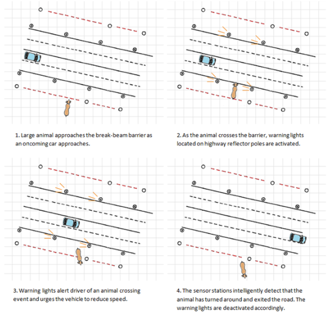
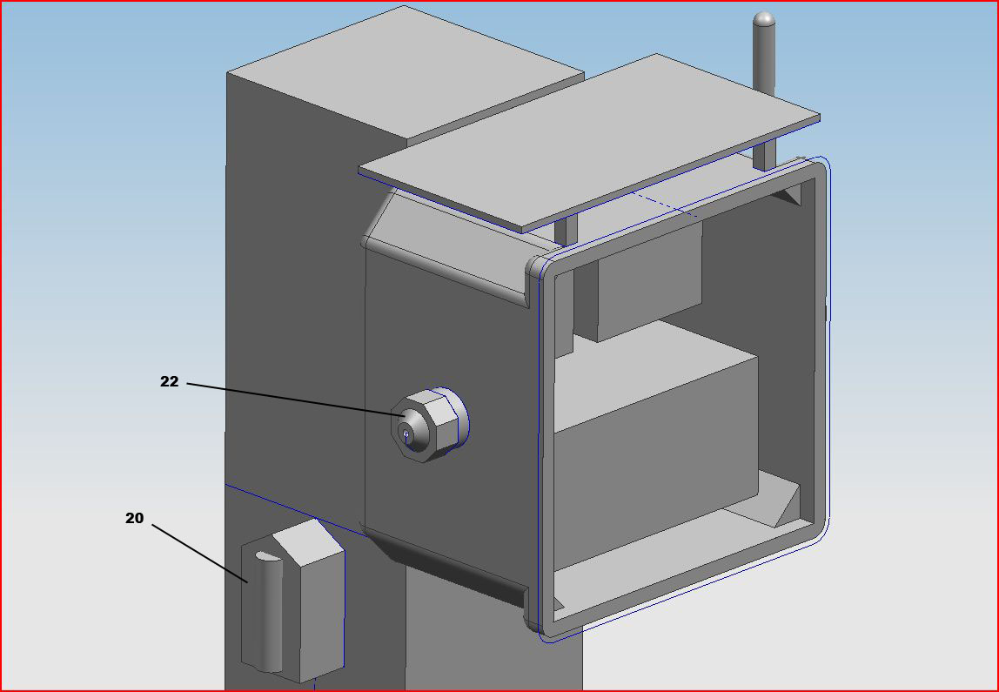
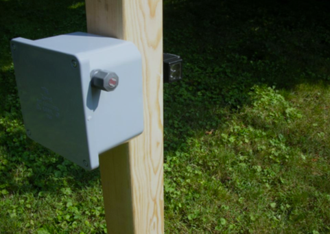

Tom came to me with an idea for a roadway animal detection system. He had already done extensive research on the market and wanted me to develop the product with him. We took a summer program where we brought our idea from idea to prototype and patent.

This was essentially a break beam system however since there were multiple types of beams on the system, we could also tell direction. Filtering and adjustments were done for different animal sizes.

Here is a picture of one of the initial prototypes. You can see the laser photo receiver on the left and on the opposite side of the pole is an active powered infrared emitter/receiver combination sensor. The top of the pole had a small solar panel that kept the internals of the system powered.

https://www.google.com/patents/US20110227733