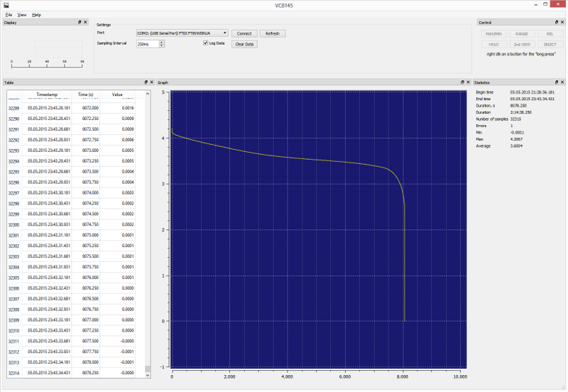
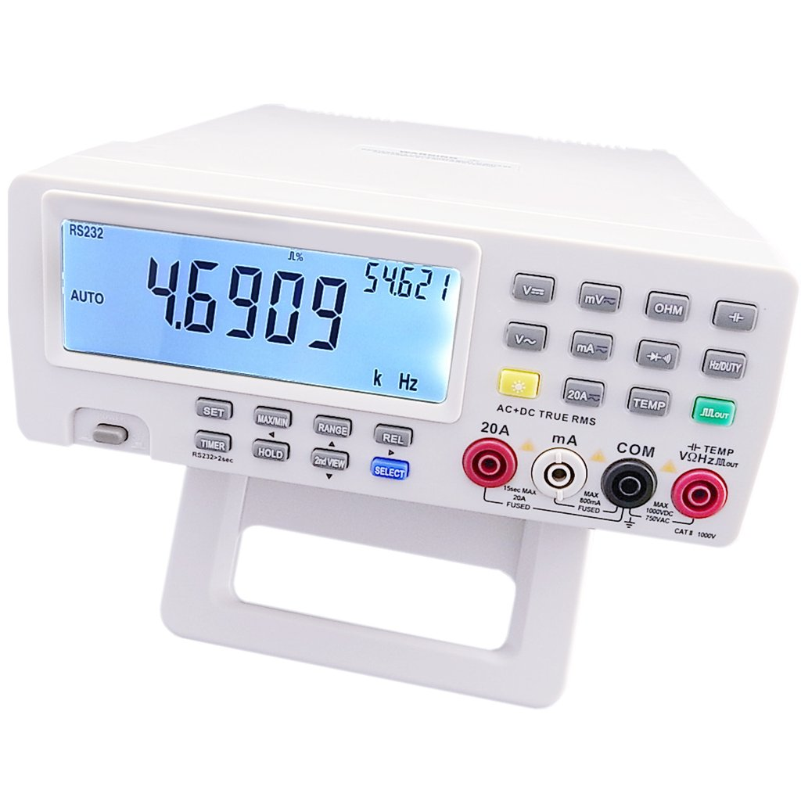
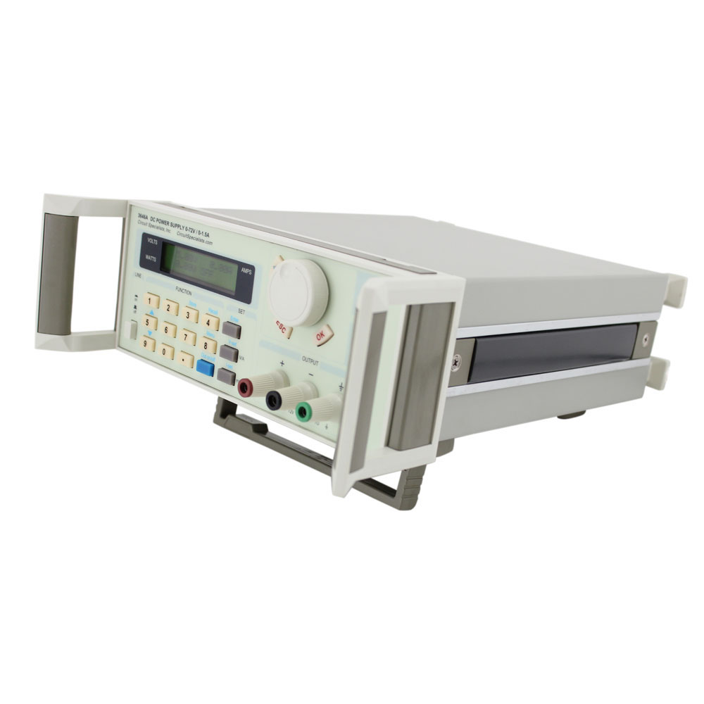
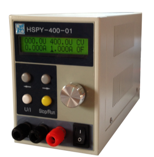
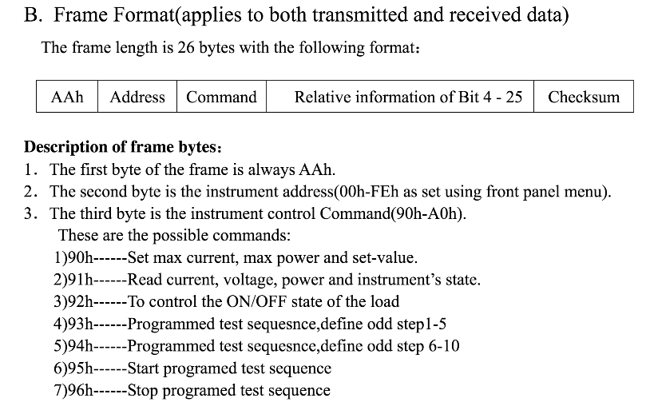
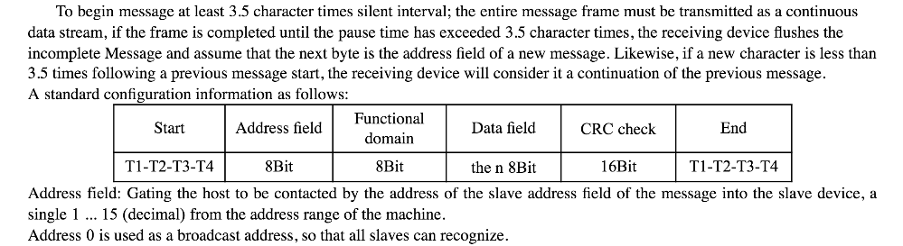
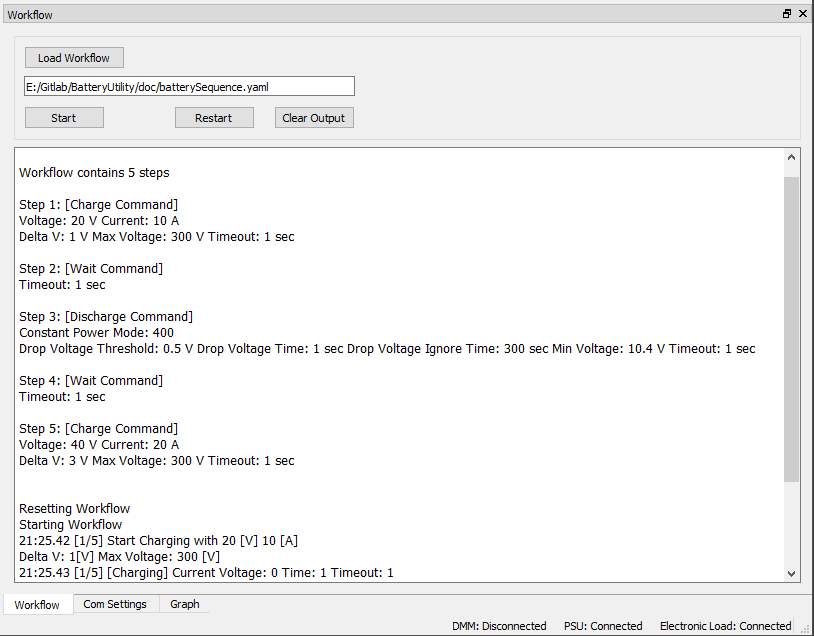
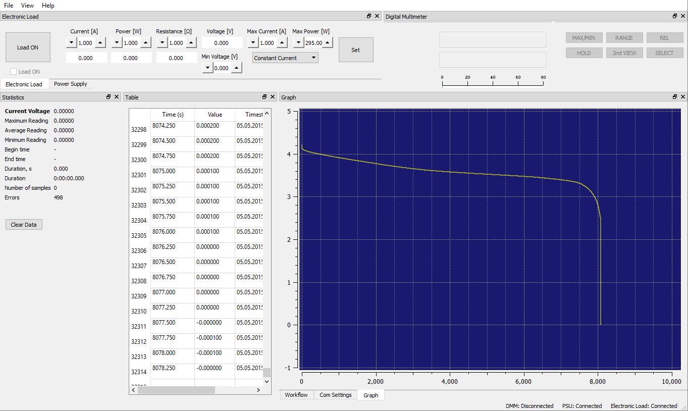

Recently I came across a project where someone was using an off the shelf digital multimeter, power supply, and electronic load to recondition hybrid batteries. This involved disassembling the full pack of cells, testing, removing, and replacing bad cells, replacing contacts, etc, before doing multiple charge and discharge cycles to verify the improvement and condition of the battery. To charge, the power supply was turned on while logging with the DMM, to discharge, the eload was used in various modes (constant current, constant power) to quantify the capacity of the cell or pack of cells. This was all done with separate softwares and had to be closely monitored to avoid damage to the pack or equipment.

There was already an existing open source software that could plot and log data from the DMM using the RS232 interface.

https://www.26th.net/public/projects/vc8145/


  


He was using this SW, in conjunction with some software in Chinese that came with the power supply and electronic load. Both pieces of hardware had RS232 interfaces as well.


  


The first step was to interpret the communication protocol for each one of these devices and add the functionality into the DMM logging software so that we have a single piece of software that can talk to all 3 devices via RS232. This will allow us to synchronize usage of the devices in the future.

The communication protocols for these devices were very difficult to find. For the power supply, I had to contact an ebay seller, and they sent me a comm protocol in chinese. Google translate did a decent job of getting something that was usable for prototyping.

With the help of a serial sniffer, I was able to duplicate the packet structures for both new devices. The eload uses a 26 byte frame formatted like this:



The checksum was simply the sum of the previous 25 bytes. I created another Qt widget for the eload, added some controls, added a communication thread to handle the serial communication and implementation of this protocol, and now had control of the electronic load!

The power supply communication proved to be a bit trickier due to the translated documentation...



Hmm...so it looks like there is a mandatory silent period before and after the packet. The packet then has a dynamic size based on the type of command being sent. Finally a 16bit crc is done on the data. Again using the packet sniffer I sent some commands using the existing software (all in chinese) and reverse engineered the commands for my purpose. I was able to create dummy packets in a unit test with the same contents from my serial sniffing tests to verify my crc algorithm was outputting the same results. With some experimentation I figured out how the voltage always had a x100 multiplier on the value and the current had a x10 multiplier, this allowed 2 bytes to represent relatively fine currents and voltages. I then created another Qt widget and comm thread to manage the power supply and the new comm protocol.

Once I could control all 3 devices properly, I then added a few minor extras for ease of use:

- Ability to zoom the plot easily
- Reset zoom
- Load old log data to the plot
- Ability to delete data from the log (in the case of a bad data point that ruins scaling)
- Confirmation dialogs
- Touch friendly interface controls for a touch screen
- Settings file with window layouts and stored settings for pretty much all numerical settings
- The ability to log voltage data from both the eload and the psu so that the DMM is not 100% necessary
- Safety settings for minimum and maximum voltages before turning devices off

The final part of this project was to take all of this newfound power and synchronize usage of the devices in a way that automated the original methods for reconditioning the batteries.

I created what I called the workflow controller. I wanted a way to input a formula or series of steps and press GO. I wanted steps like charge with x settings, sleep for 10 minutes, discharge with x settings, sleep for 10 minutes.

I decided to use yaml and yaml-cpp for its relative ease of use. I added the yaml-cpp dependency and came up with a schema I wanted to use. A valid workflow looks something like this:
```yaml
- type: charge
  voltage: 20
  current: 10
  deltav: 1
  timeout: 1
  maxvoltage: 300

- type: wait
  timeout: 1

- type: discharge
  current: -1
  power: 400
  dropthresholdvoltage: 0.5
  dropthresholdtime: 1.0
  timeout: 1
  minvoltage: 10.4

- type: wait
  timeout: 1

- type: charge
  voltage: 40
  current: 20
  deltav: 3
  timeout: 1
  maxvoltage: 300

- type: charge
  voltage: 20
  current: 10
  deltav: 1
  timeout: 1
  maxvoltage: 300
 
- type: wait
  timeout: 1
 
- type: discharge
  current: -1
  power: 400
  dropthresholdvoltage: 0.5
  dropthresholdtime: 1.0
  timeout: 1
  minvoltage: 10.4
 
- type: wait
  timeout: 1
 
- type: charge
  voltage: 40
  current: 20
  deltav: 3
  timeout: 1
  maxvoltage: 300
```

I would then load this file, and parse it into a vector of SequenceCommands with the applicable settings. I then created a thread that when started, will tick every 10ms, check the state of all inputs, and increment to the next command or step of the sequence if certain criteria were met.

Whether charging, discharging, or sleeping, a timeout was active which if reached would consider the step done and move on (after turning off all devices in use). When charging a voltage and current were set and sent to the PSU, then the voltage was monitored for a charge complete scenario. When discharging, you can either use power or constant current modes, and again the voltage is monitored for a discharge or minimum voltage scenario.



The end result is the ability to put a new battery cell or pack onto the rig, hook everything up, load a sequence, press “Start”, and come back in several hours later with a completed cycle!

