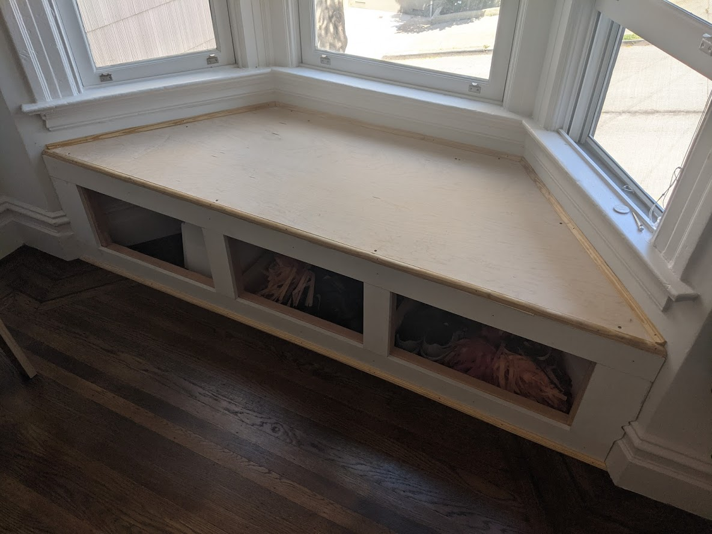

This room was missing some necessary storage... and a place for a cat to sleep. The plan was simple, a pretty straightforward bench with storage.

First up was to put some tape down to decide how wide to make the bench.

Put some supports on the wall and started to build out the frame for the load bearing portion of the bench.

Cardboard was used to create a template for the bench top since the walls are all a bit off.

Pocket screws, pocket screws, and pocket screws!

Top fits perfectly... after some adjustments...

Time to start on the face frame to cover up the ugly construction grade 2x4s. A bit of work with the coping saw and I think we are in business.

Face frame completed and mounted.

Quarter round and cove moulding all installed. Ready for some spackle and paint.

Painted and ready for doors.

Had to use the oscillating saw to make some notches for the hinges.

Doors were ordered online to fit perfectly.

Painted and all done!

Cat approves.

