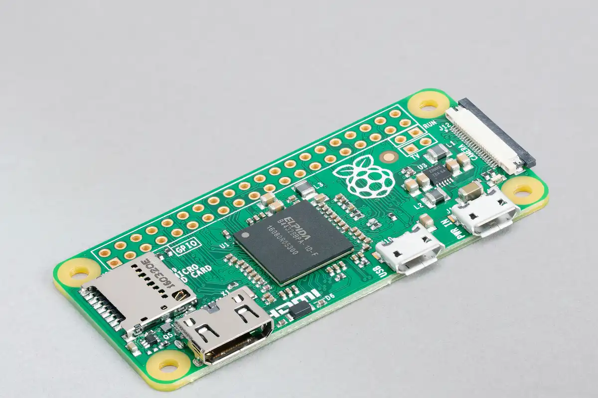
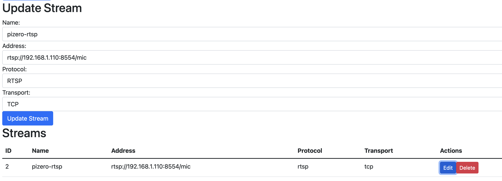
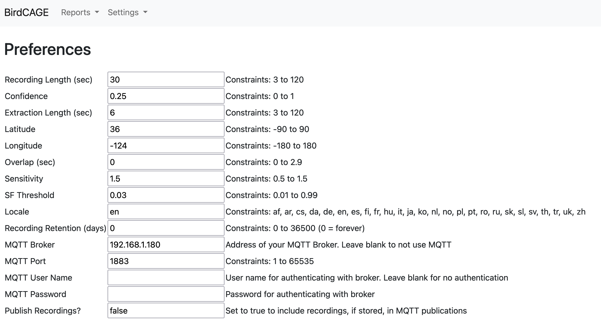
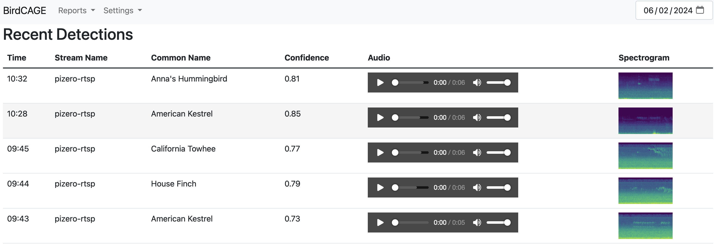
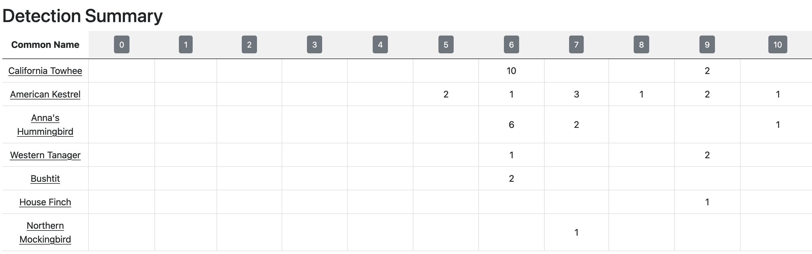
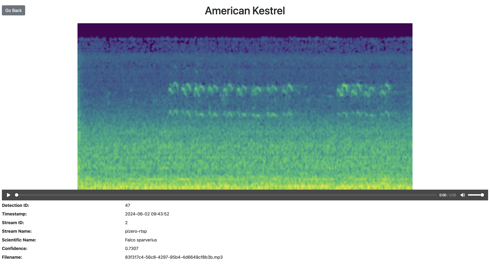
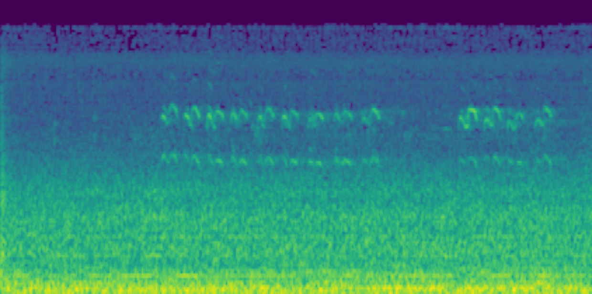

There is a model that has been developed called [BirdNET](https://birdnet.cornell.edu/)

> BirdNET is a research platform that aims at recognizing birds by sound at scale. We support various hardware and operating systems such as Arduino microcontrollers, the Raspberry Pi, smartphones, web browsers, workstation PCs, and even cloud services. BirdNET is a citizen science platform as well as an analysis software for extremely large collections of audio. BirdNET aims to provide innovative tools for conservationists, biologists, and birders alike. -[BirdNET](https://birdnet.cornell.edu/)

There is a project [BirdNET-Pi](https://github.com/mcguirepr89/BirdNET-Pi) that has created an image to run this model and various web services on a raspberry pi.

I have a server running already so I was hoping to run the model in something more portable, ideally a docker image. After a quick search I found [BirdCAGE](https://github.com/mmcc-xx/BirdCAGE) which repackages the components into some docker images.

My docker-compose.yaml:

```yaml
services:
  birdcage_redis:
    container_name: birdcage_redis
    image: "redis:latest"
    restart: always

  birdcage_backend:
    container_name: birdcage_backend
    image: mmcc73/birdcage_backend:latest
    depends_on:
      - birdcage_redis
    environment:
      DATABASE_FILE: /db/birdcage.db
      API_SERVER_PORT: 7007
      TEMP_DIR_NAME: tmp
      ANALYZE_SERVER: 192.168.1.XXX
      ANALYZE_PORT: 7667
      DETECTION_DIR_NAME: detections
      CORS_ORIGINS: http://192.168.1.XXX:7008
      REDIS_SERVER: birdcage_redis
      REDIS_PORT: 6379
      CONCURRENCY: 10
      JWT_SECRET_KEY: xxxxx
      PULSE_SERVER: 172.17.0.1
    tmpfs:
      - /tmp:size=16M
    volumes:
      - ${DOCKER_VOLUMES}/birdcage/detections:/detections
      - ${DOCKER_VOLUMES}/birdcage/db:/db
      - /etc/localtime:/etc/localtime:ro
      - /etc/timezone:/etc/timezone:ro
    ports:
      - 7007:7007
    restart: always

  birdcage_frontend:
    container_name: birdcage_frontend
    image: mmcc73/birdcage_frontend:latest
    depends_on:
      - birdcage_backend
    environment:
      API_SERVER_URL: http://192.168.1.XXX:7007
      WEBUI_PORT: 7008
    volumes:
      - /etc/localtime:/etc/localtime:ro
      - /etc/timezone:/etc/timezone:ro
    ports:
      - 7008:7008
    restart: always

  birdnetserver:
    container_name: birdnetserver
    image: mmcc73/birdnetserver:latest
    ports:
      - "7667:8080"
    restart: always
```

Once the containers were running, I was able to access the web-ui and now it was time to figure out an audio source.

I wanted to separate the audio/mic source to be low power and easily movable for positioning. I opted to use an omnidirectional lavalier microphone into an old pi zero w I had lying around.




https://www.amazon.com/dp/B07RMXR4FB

In order to create the RTSP stream from the microphone, I used [go2rtc](https://github.com/AlexxIT/go2rtc)

My go2rtc.yaml config file:

```yaml
streams:
  mic:
    - exec:ffmpeg -hide_banner -f alsa -channels 1 -sample_rate 48000 -i hw:0,0 -c:a libopus -rtsp_transport tcp -f rtsp {output}
```

This creates a single RTSP stream using the microphone via alsa. At first I used AAC but found it a bit too taxing for this single core CPU. Switching to OPUS as the codec lowered the CPU usage quite a bit.

Once I had the RTSP stream up and running I tested it briefly with ffprobe and VLC

```bash
❯ ffprobe rtsp://192.168.1.110:8554/mic
ffprobe version 7.0.1 Copyright (c) 2007-2024 the FFmpeg developers
  built with Apple clang version 15.0.0 (clang-1500.3.9.4)
  configuration: --prefix=/opt/homebrew/Cellar/ffmpeg/7.0.1 --enable-shared --enable-pthreads --enable-version3 --cc=clang --host-cflags= --host-ldflags='-Wl,-ld_classic' --enable-ffplay --enable-gnutls --enable-gpl --enable-libaom --enable-libaribb24 --enable-libbluray --enable-libdav1d --enable-libharfbuzz --enable-libjxl --enable-libmp3lame --enable-libopus --enable-librav1e --enable-librist --enable-librubberband --enable-libsnappy --enable-libsrt --enable-libssh --enable-libsvtav1 --enable-libtesseract --enable-libtheora --enable-libvidstab --enable-libvmaf --enable-libvorbis --enable-libvpx --enable-libwebp --enable-libx264 --enable-libx265 --enable-libxml2 --enable-libxvid --enable-lzma --enable-libfontconfig --enable-libfreetype --enable-frei0r --enable-libass --enable-libopencore-amrnb --enable-libopencore-amrwb --enable-libopenjpeg --enable-libspeex --enable-libsoxr --enable-libzmq --enable-libzimg --disable-libjack --disable-indev=jack --enable-videotoolbox --enable-audiotoolbox --enable-neon
  libavutil      59.  8.100 / 59.  8.100
  libavcodec     61.  3.100 / 61.  3.100
  libavformat    61.  1.100 / 61.  1.100
  libavdevice    61.  1.100 / 61.  1.100
  libavfilter    10.  1.100 / 10.  1.100
  libswscale      8.  1.100 /  8.  1.100
  libswresample   5.  1.100 /  5.  1.100
  libpostproc    58.  1.100 / 58.  1.100
[rtsp @ 0x15a004e70] method SETUP failed: 461 Unsupported transport
Input #0, rtsp, from 'rtsp://192.168.1.110:8554/mic':
  Metadata:
    title           : go2rtc/1.9.2
  Duration: N/A, start: 0.000000, bitrate: N/A
  Stream #0:0: Audio: opus, 48000 Hz, stereo, fltp
```

Once it was confirmed working and I could hear sound, I added the stream as a source to BirdCAGE.



BirdNET has some tunables so I adjusted lat/long which are used as algorithm inputs, along with the accepted confidence level.



After some time running, I started to get detections!



There is a section that shows a detection count split by time of day



Here are the details shown per detection (along with a 6 second recording)




