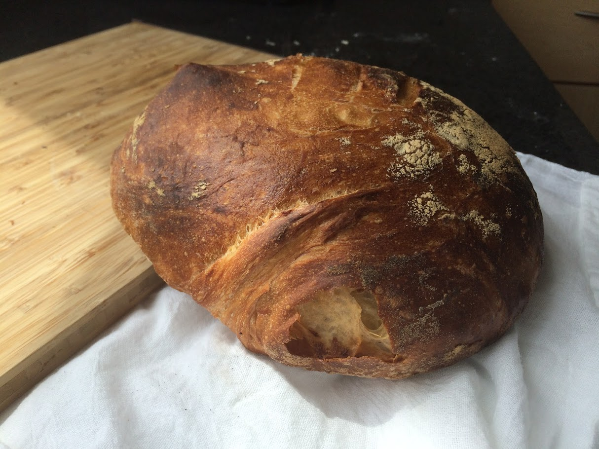

This is a post that doesn't involve any computers or technology... but has definitely consumed a TON of my time and effort in the past few years.

I first started making bread many years ago using the no knead method. It was easy, 4 ingredients, and the only piece of equipment needed was a dutch oven (~$40). The bread that came out of this tasted like magic. You put some raw boring ingredients in (flour, water, salt, and some instant yeast), and out came something warm, ready for a ton of butter. It was too easy to stand at the kitchen counter and eat half of a loaf of bread.

[Mark Bittman's No Knead Bread](https://cooking.nytimes.com/recipes/11376-no-knead-bread)

I used this recipe for years, and the loaves were always delicious and foolproof. The dutch oven steams the bread as it rises for about 30 minutes, then you take the lid off for the last 15 minutes, and it gets nice and browned. Here is an example loaf I made using this recipe:

After a few years, I purchased some new books:

#1 [Flour Water Salt Yeast by Ken Forkish](https://www.amazon.com/Flour-Water-Salt-Yeast-Fundamentals/dp/160774273X)

#2 [The Bread Baker's Apprentice by Peter Reinhart](https://www.amazon.com/Bread-Bakers-Apprentice-15th-Anniversary/dp/1607748657/)

And I can safely say, Ken Forkish is a genius. His book is my #1 reccomendation to people looking to get into this. I have gifted it multiple times and have converted a bunch of people to bread bakers. I get text messages nearly weekly with pictures of freshly baked loaves of bread that friends want to share with my, years after getting them hooked on bread baking.

His techniques are simple, and easy to apply to all doughs moving forward. Pizza doughs, bread doughs, etc. He works with a very high hydration dough (high water content), which makes this great textured bread with tons of air pockets.

There is also a lot of interesting sourdough (levain) recipes that involved a sourdough starter that lived in my fridge for some amount of time and was periodically fed more flour and water to capture the natural yeast and lactobacilli that are floating around the air all around us.

For other types of bread (ciabatta, challah, english muffins, bagels, cinnamon buns, sticky buns, baguettes, bagels, etc) the Bread Baker's Apprentice provided a way of rounding out my bread-sperience.



Here is some layered croissant dough. Every line is a layer of butter in between folds of dough that once baked will turn into the flakey, deliciousness.



Some awesome sticky buns from [The Food Lab by J. Kenji López-Alt](https://www.amazon.com/Food-Lab-Cooking-Through-Science/dp/0393081087)

This is another must-have book that I have nearly cooked my whole way through... but this post is for bread only!

