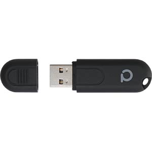
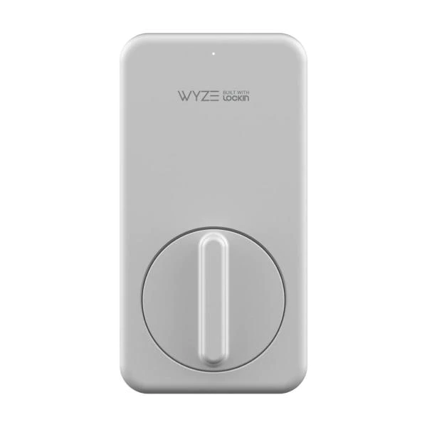
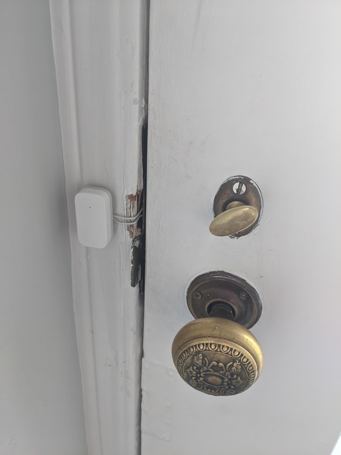
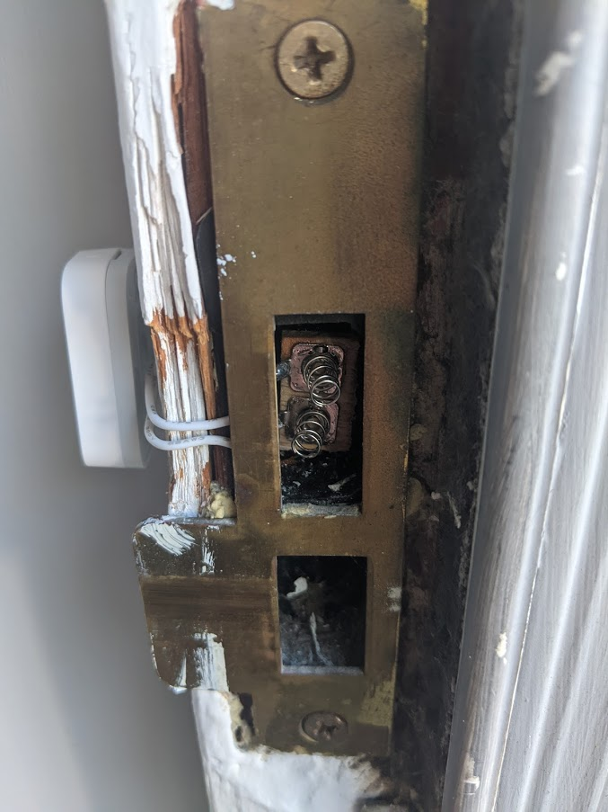
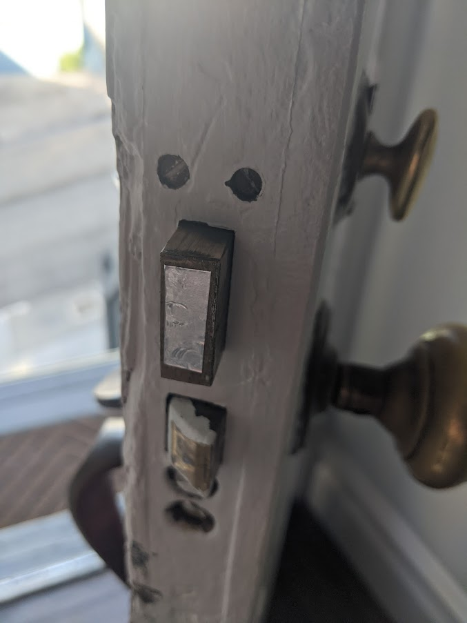

I added a [Zigbee](https://en.wikipedia.org/wiki/Zigbee) mesh network to my home automation setup using a Conbee II usb adapter. https://phoscon.de/en/conbee2

This allows me to add low powered sensors and switches to control lights and other things. I primarily got it because the light switch for the backyard lights is OUTSIDE. So when the raccoons come, the only way to turn on the lights would be to go outside WITH the raccoons to turn on the lights. I put a smart light switch there, and then a small zigbee button by the back door that triggers the light to turn on and off through an automation in home assistant.

Now that I had this network, I wanted to have the ability to know whether or not the doors are locked/unlocked. I tried a smart lock first, but it was deemed "too ugly" and large.

Since I didn't need the ability to lock/unlock, I decided to try to come up with a way to just make the dumb-deadbolt, a smart-deadbolt.

Here is the finished product using a cheap reed switch wireless door sensor. I opened it up, removed the reed switch, and soldered 2 wires to the contact points the reed switch was bridging.

I then ran the 2 wires to some battery springs. The mess of the door jamb was not me, that is a project for another day I suppose...

For some reason, the deadbolt was not conductive. I put a meter on it and could not get a tone, so decided to just put some HVAC aluminum tape (I don't have any copper tape laying around).

When the deadbolt closes, it touches and bridges the 2 springs inside, and then transmits its state change to the conbee II and zigbee network, which get relayed to home assistant and then report the state of the lock on a nice dashboard.

I plan on setting up an automation to detect if the doors are unlocked after a certain time, to send a notification to my phone.
