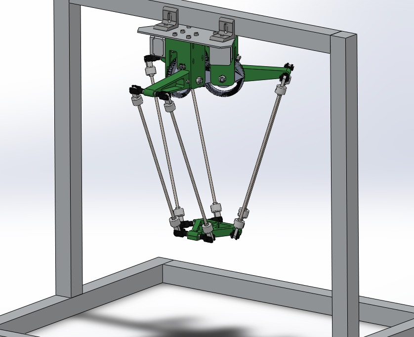
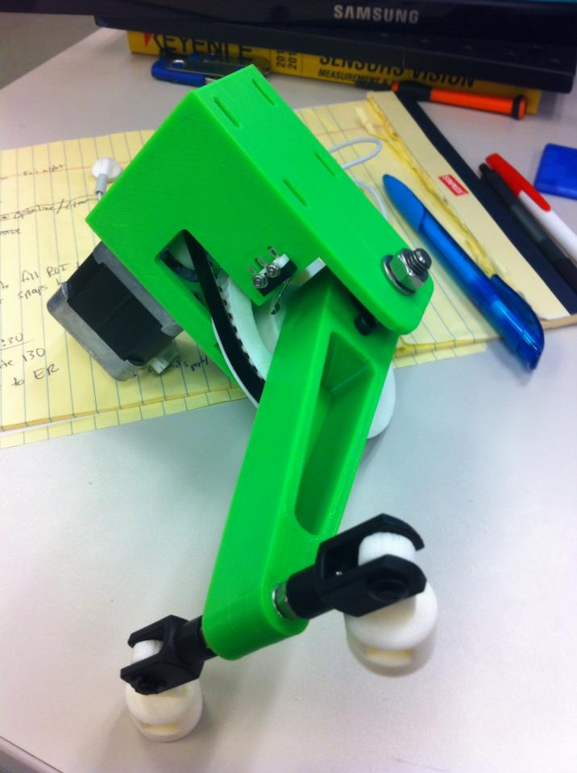
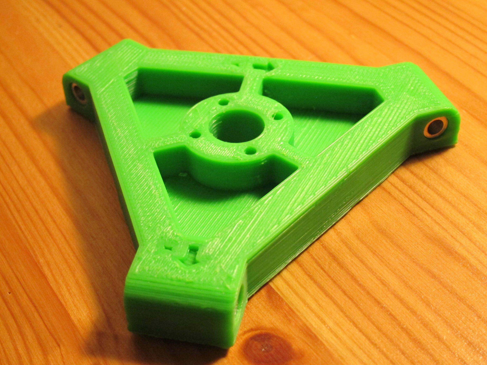

My friend Vince and I wanted to put my new 3D printer (see previous post) to good use!

We decided to design and build a delta style pick and place robot from scratch.

Vince started with the CAD. A large majority of this project was done on the train to/from work. We decided on threaded rod for the parallel links, and some u-joints from McMaster-Carr for to give us some of the motion we needed. Once he finished up the CAD, we ordered parts and got to work printing...

All of the green and white parts were printed on the prusa i3 printer I made in the previous post.

We used limit switches to perform a homing sequence before moving to 0 degrees.

Here is the platform where you could attach an end effector, arrows for +X and +Y to visualize directional information during programming.

Vince has a lot of experience with the kinematics and the controller we were using so he did all of that. I wrote a motor controller driver that then plugged into the output of the kinematics library to move the inner links exactly where we needed them to be.


