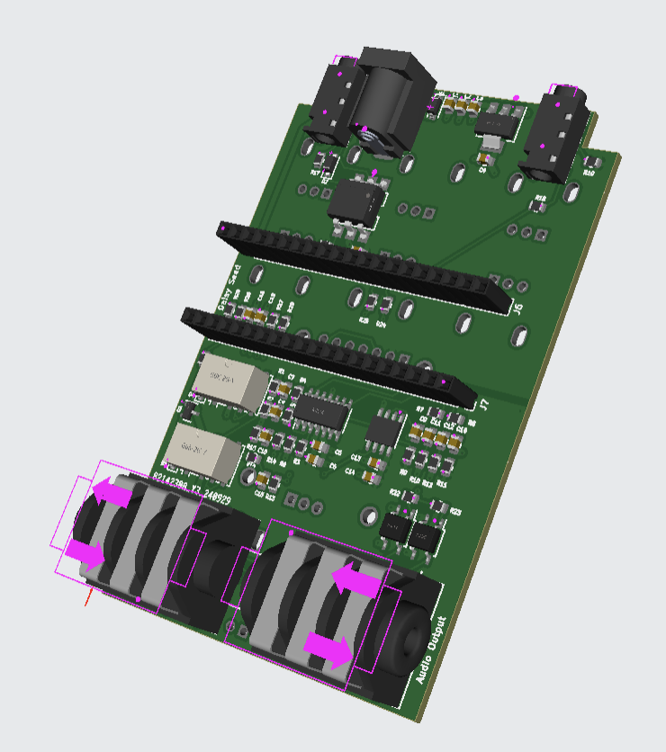

After building a few (6?) analog guitar pedals, I wanted to try to use my software abilities to make a digital pedal. I considered a Teensy or [Daisy Seed](https://electro-smith.com/products/daisy-seed?variant=45234245108004) as the embedded platforms. During my search, I came across this project, [bkshepherd/DaisySeedProjects](https://github.com/bkshepherd/DaisySeedProjects), that already had done SO MUCH of the legwork. It was on revision 7 of hardware, had all sorts of options, a screen, and utilized the Daisy Seed. I decided to save a lot of time and effort and build this project instead of designing a board from scratch! I am super thankful for the work that Keith put in and it has been fun to be able to work on the project with him!

I downloaded the KiCad project files, checked the schematic out, generated the necessary manufacturing files, and sent them off to JLCPCB to build and populate 2 boards! This was my first time using PCB-A (PCB assembly), a service where they will place and solder surface mount and other components so the boards come to you nearly complete. This is what the boards look like from the factory.

I paid ~$100 for 2 populated boards and 3 unpopulated PCBs (to meet the 5 board minimum). They arrived a few weeks later and I finished assembly of the pedals by adding the potentiometers, daisy seed, encoder, foot switches, and screen.

I then flashed the latest software and tested the hardware, success!

Little did I know just how much of a time sink programming this would turn out to be...instead of actually practicing/playing guitar. I became a contributor to the project, and added multiple effect modules and fixes.

I added these modules at the time of writing this:

- Tuner
- Looper
- Compressor
- Pitch Shifter
- Graphic EQ
- Parametric EQ

While working on the tuner, I discovered this library https://github.com/cycfi/q and found it to be a great resource! The main developer of the library, Joel, was very friendly and we had quite a bit of discussion on discord and github on how to get the best results for pitch detection and smoothing.

Tuner:


Pitch Shifter:


I also discovered and learned about the [1 euro filter](https://gery.casiez.net/1euro/) which I will certainly be using in the future for other applications. There is a really cool online demo available [here](https://gery.casiez.net/1euro/InteractiveDemo).

I experimented with some amp and cabinet neural models from another project as well, [GuitarML/FunBox](https://github.com/GuitarML/FunBox).

I found myself writing a lot more software than playing guitar for what is supposed to be a no-screen-oriented hobby, so am going to try to do less of that in 2025, but we will see!
