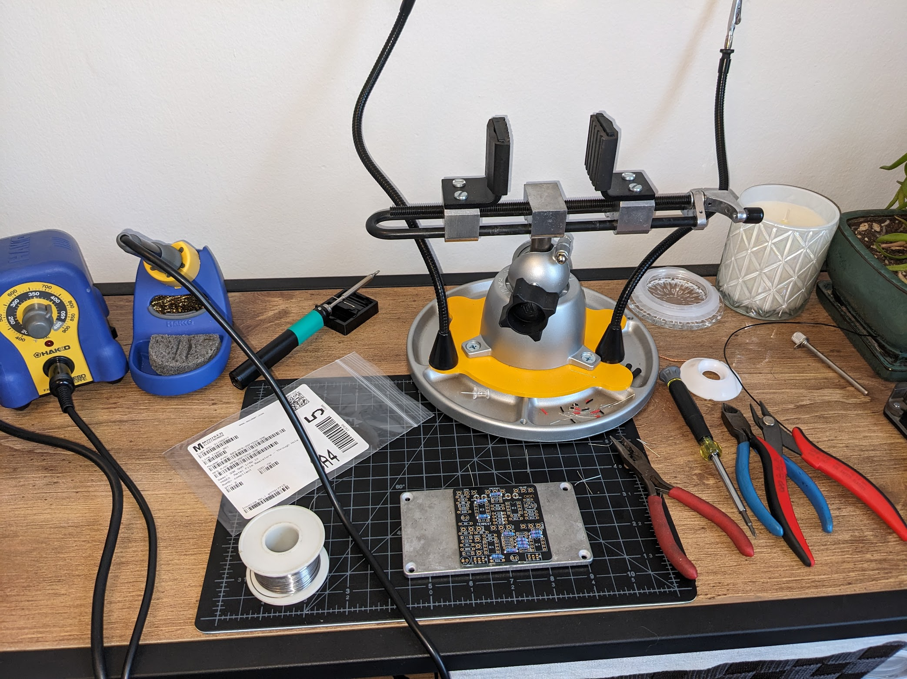
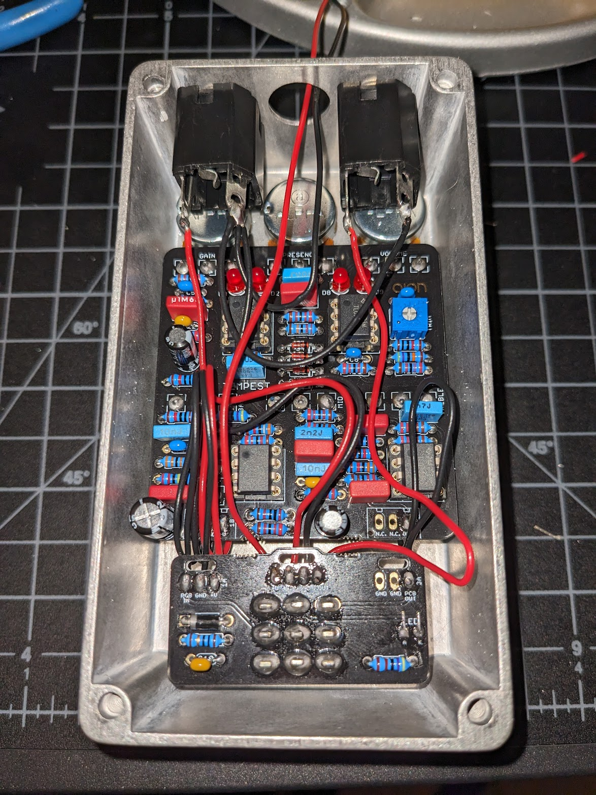
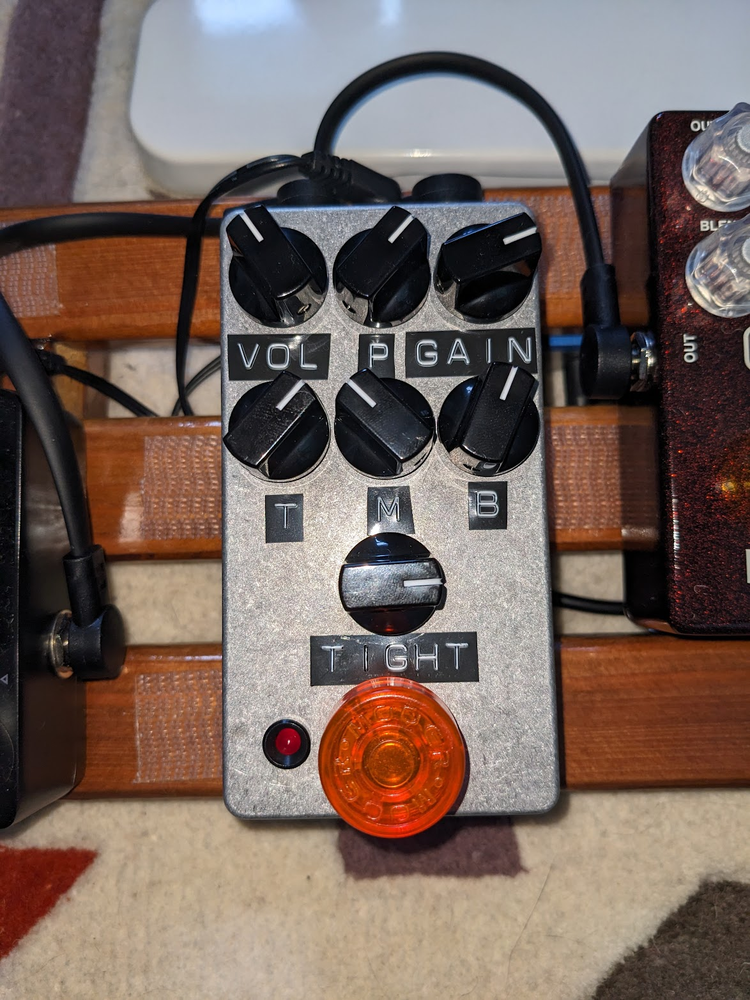
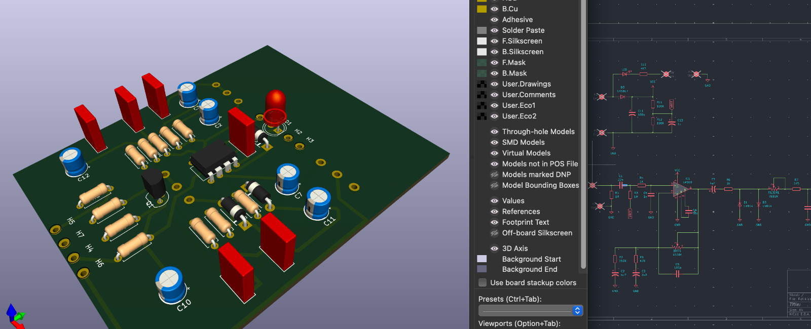
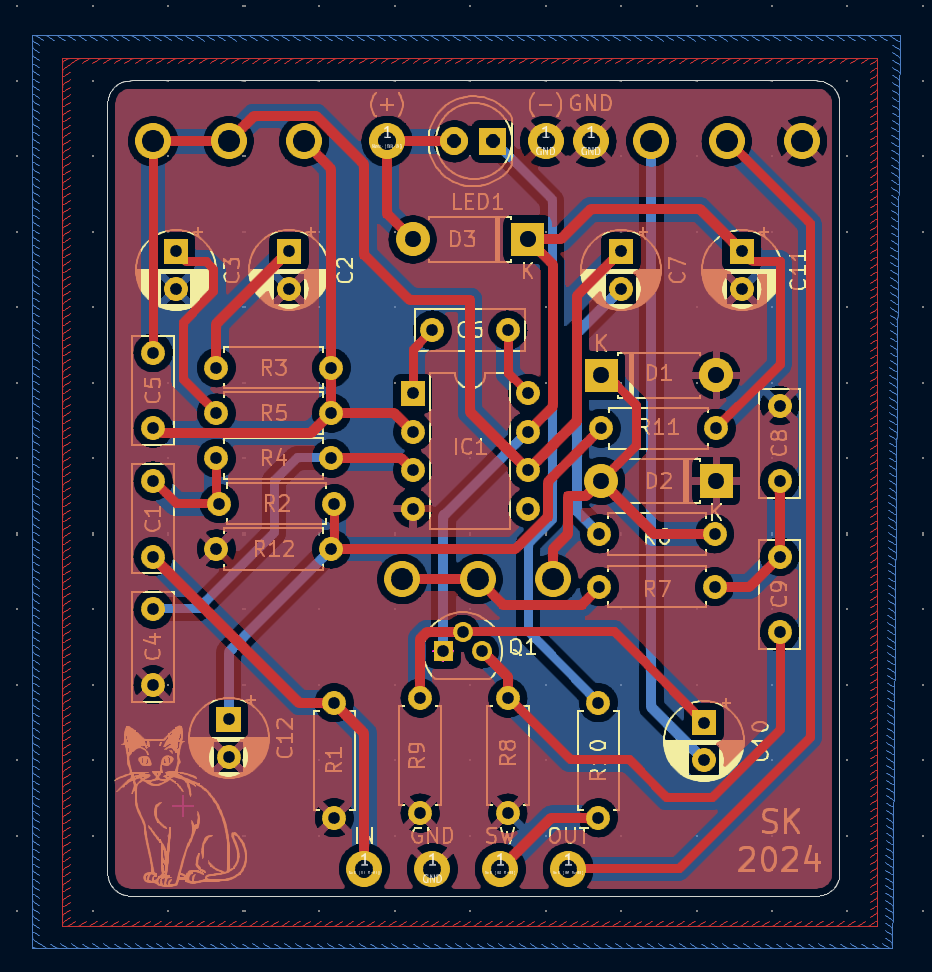
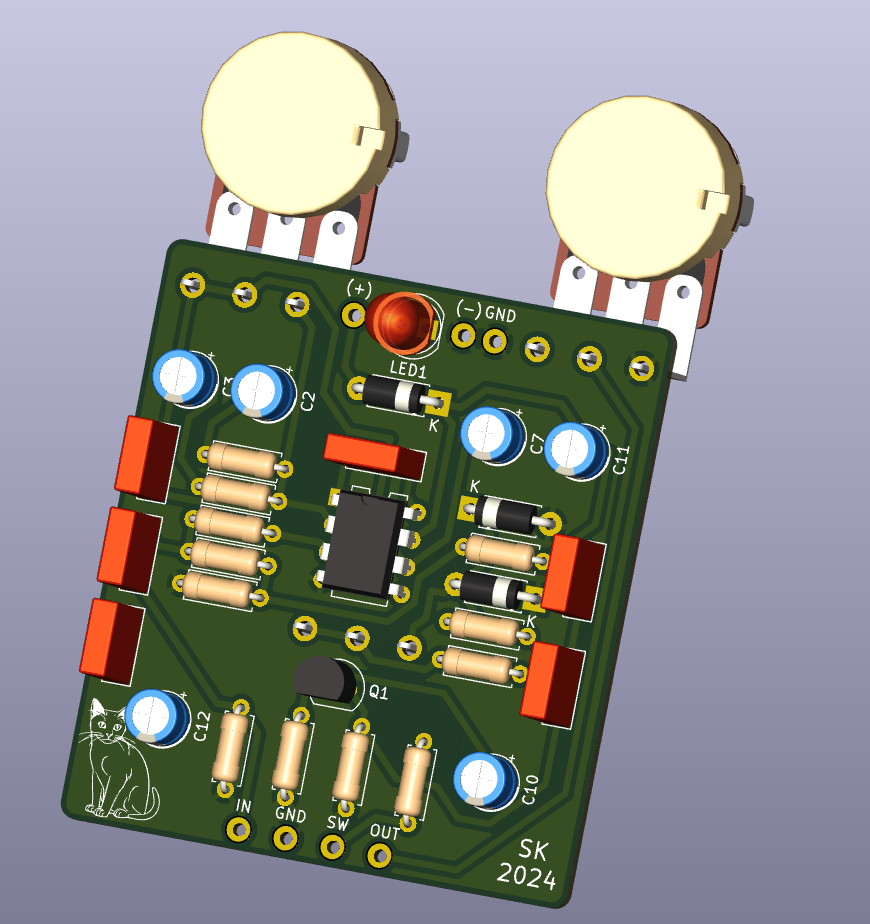
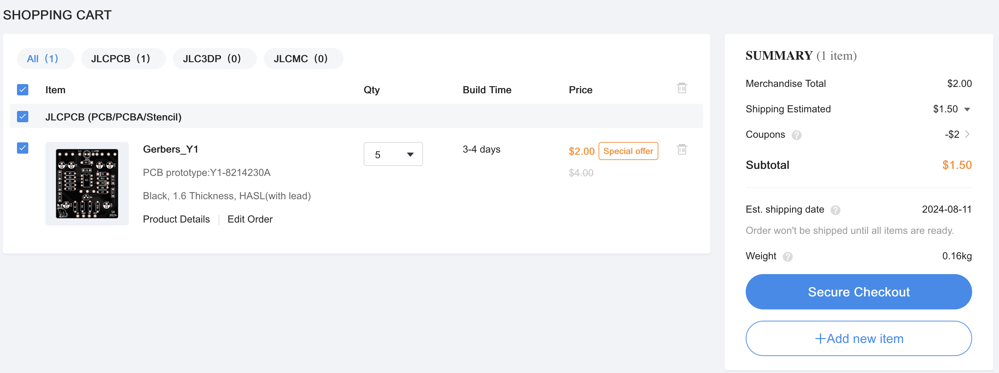
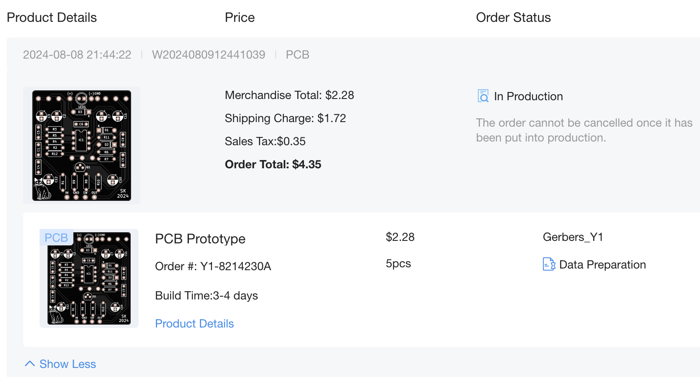
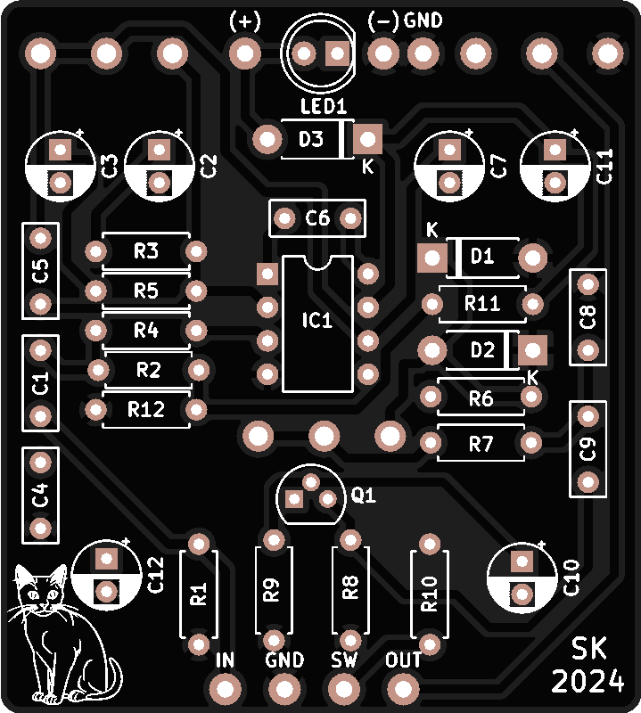

Even though I have an electrical engineering degree, I have never actually designed a PCB layout or had a PCB manufactured. I figured a simple clone of a known guitar pedal circuit would be a great place to start!

I had previously built a pedal with a purchased PCB (~$12) and was curious to see if I could make a PCB for cheaper than that or at least in the same ballpark...

Here are a few pictures of that pedal and process:

That pedal was a clone of the Friedman BE-OD and the PCB was from [aionfx](https://aionfx.com/project/tempest-amp-distortion/). It sounds great and I use it everyday!

The [Pro Co RAT](https://en.wikipedia.org/wiki/Pro_Co_RAT) is a classic guitar distortion pedal that has been around since the late 1970s.

I did some quick googling and came to the conclusion that https://www.kicad.org/ would be the best option for me to go down this route with.

I didn't want to do too much design/engineering of the actual circuit at this point because PCB manufacturing was the main goal of this project. I mostly just used the schematic directly from [PedalPCB's](https://www.pedalpcb.com/product/pcb038/) version of a RAT.

Here is an early screenshot I took of my learning progress before redoing all of the layout and traces.

Here is the final PCB showing the 2 copper layers I used for traces (blue and red). I kept all of the trace widths to ~0.6mm for power and signal for simplicity even though the signal traces could certainly be smaller.

Here is the final 3D view of the PCB from KiCad.

Now that the design was done, it was time to get it manufactured. I checked https://jlcpcb.com/ and https://oshpark.com/ and went with jlcpcb. I exported my project's files from KiCad, uploaded them to jlcpcb, and was brought to the order page for a grand total of....

Less than $5 for 5 boards shipped from China...wow. I am not sure what I expected but this was even cheaper than I expected.

I then had to wait a few weeks for the boards to arrive. In the meantime I placed an order for all of the electronic components, the enclosure, and the knobs, so that once the boards arrived I could start to put it all together!

Reference:
https://www.electrosmash.com/proco-rat
