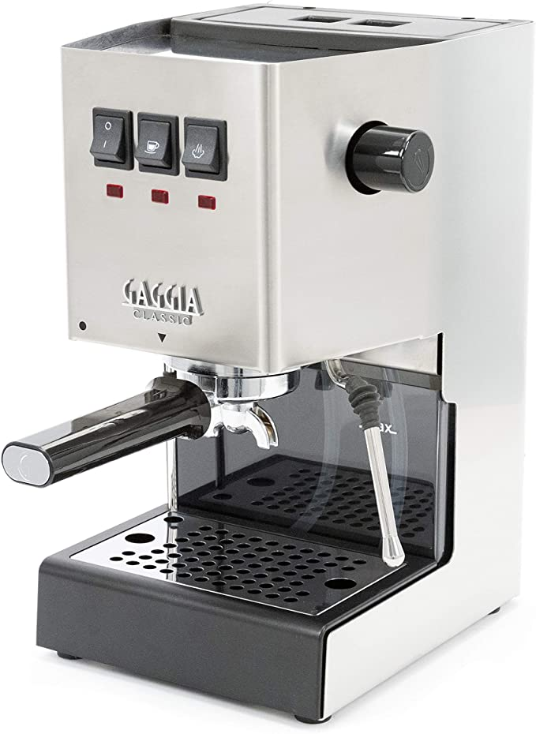
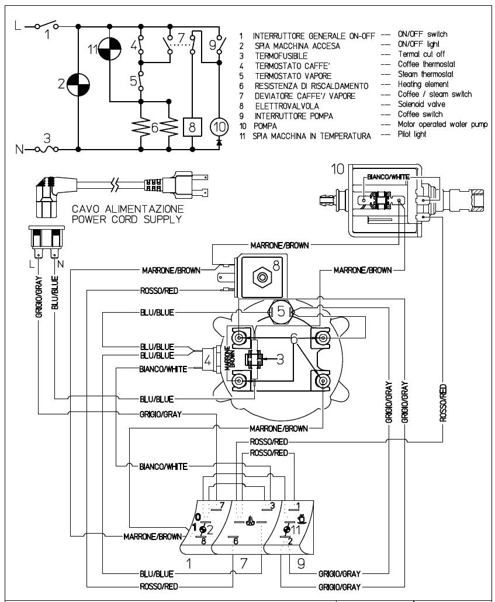
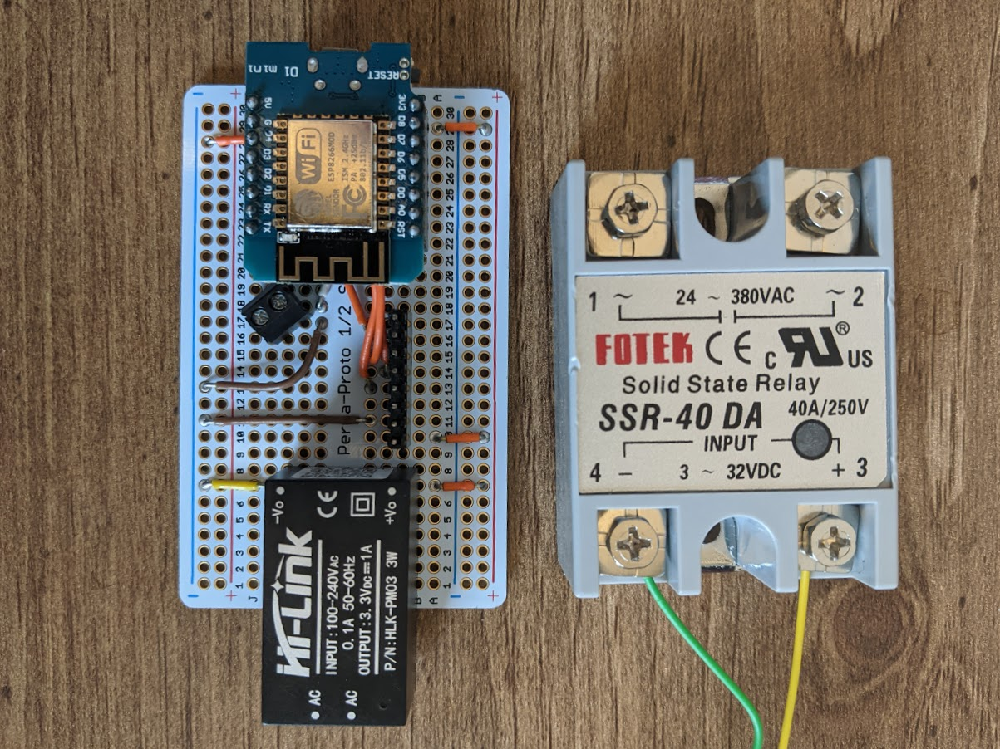
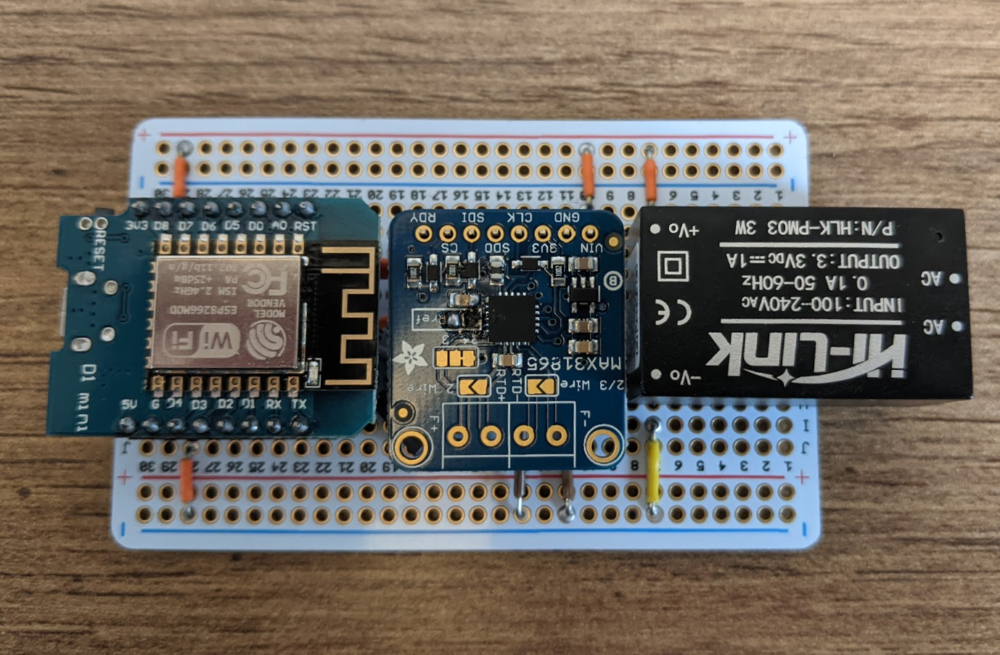
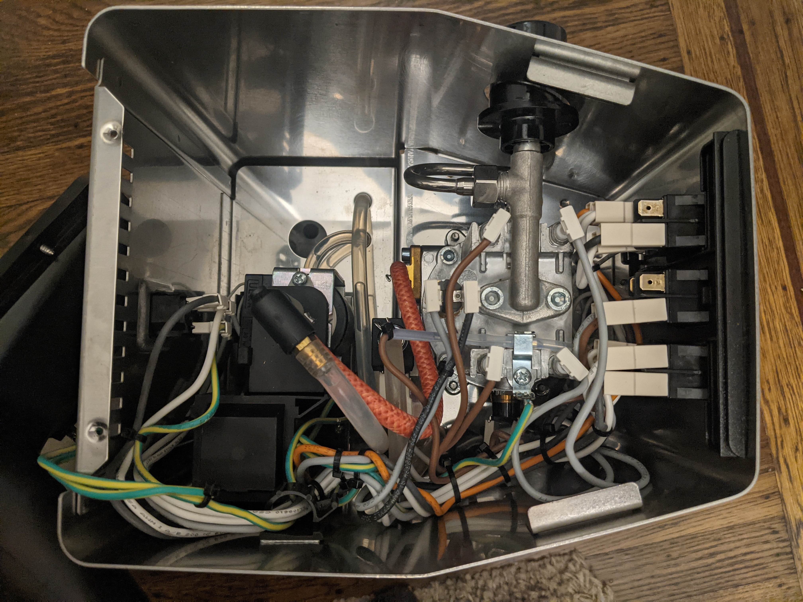

During the pandemic, due to working from home, I finally was able to justify an espresso machine. Previously, I primarily made a weekend cup or two using my aeropress, and consumed most of my coffee at the office, but now my home is also my office...

I did some reasearch and settled on the Gaggia Classic. It is simple, heavy duty, and modifiable if I ever decided to make some DIY adjustments in the future (spoiler alert...hence this post...).

The first adjustment I made was lowering the pressure of the pump from the factory ~14 bar to a more appropriate ~9 bar which is standard for espresso. They come configured higher to work with expensive ESE pods which I do not use/need since I have a suitable espresso grinder and prefer to grind my coffee fresh.

This modification consisted of switching out a spring in the over pressure valve with a known good spring from other coffee enthusasts.

A few months later, there was one last change I wanted to make, stable temperature control.

The Gaggia has a small boiler to heat the water up and a pump to push it through the coffee. Prior to this modification, the heater to the boiler would cycle on and off every ~4 minutes using a thermostat set to ~200 degrees F. This meant that the temperature would drop to 199, and the heater would turn on for a few seconds, causing the temp to rise on an upward curve towards 220+, and then it would slowly drop again over ~4 minutes and the cycle would repeat. This makes it difficult to pull a consistent espresso shot, so I decided to swap out the thermostat with some hardware and software to keep the temperature stable at a desired temperature.

Here is what the original schematic of the Gaggia Classic looks like:

The goal is to replace #4 in the diagram, the brewing thermostat, with a relay, that can be controlled based in information from a thermocouple mounted to the boiler.

So the hardware I bought:

- PT100 RTD thermocouple M4 threads - $8 from Aliexpress
- 40A Solid State Relay - $12 from Amazon
- Wemos D1 ESP8266 - $4 from Amazon
- Adafruit PT100 RTD Amplifier MAX31865 - $15 from Adafruit
- HLK-PM03 120v AC to 3.3v DC power supply - $7 from Amazon

I also needed some protoboard, spade connectors, and hookup wire (some heavier gauge since some will be 120v AC)

Here is how the hardware stacks up on the protoboard. There is definitely some room inside the machine, so this should not pose any issues, but we will get to that later!

Here is the unmodified machine, the open area is where I will be targeting the install, however there is a funnel that runs through that area that takes up some amount of space that I should be aware of.

On to the software running on the ESP8266...

The source code can be found at https://github.com/xconverge/gaggia-pid

The features implemented in under 500 lines are:

- Connects to wifi to allow for interfacing with the device (instead of having a screen or additional buttons)
- RESTful API for getting stats, setting the desired temperature, and tuning the PID parameters
- MQTT publishing of stats (runtime, temperature, etc.)
- EEPROM read/write for storage of PID parameters and desired temperature
- Reading of RTD temp sensor via SPI
- PID control of a SSR
- PID autotuning library to get starter/baseline tuning
- Cutoff temperature to disable PID control incase something goes wrong

Now it was time to assemble and test...
