During the pandemic, due to working from home, I finally was able to justify an espresso machine. Previously, I primarily made a weekend cup or two using my aeropress, and consumed most of my coffee at the office, but now my home is also my office...

I did some research and settled on the Gaggia Classic. It is simple, heavy duty, and modifiable if I ever decided to make some DIY adjustments in the future (spoiler alert...hence this post...).


The first adjustment I made was lowering the pressure of the pump from the factory ~14 bar to a more appropriate ~9 bar which is standard for espresso. They come configured higher to work with expensive ESE pods which I do not use/need since I have a suitable espresso grinder and prefer to grind my coffee fresh.

This modification consisted of switching out a spring in the over pressure valve with a known good spring from other coffee enthusiasts.

A few months later, there was one last change I wanted to make, stable temperature control.

The Gaggia has a small boiler to heat the water up and a pump to push it through the coffee. Prior to this modification, the heater to the boiler would cycle on and off every ~4 minutes using a thermostat set to ~220 degrees F. This meant that the temperature would drop to 219, and the heater would turn on for a few seconds, causing the temp to rise on an upward curve towards 230+, and then it would slowly drop again over ~4 minutes and the cycle would repeat. This makes it difficult to pull a consistent espresso shot, so I decided to swap out the thermostat with some hardware and software to keep the temperature stable at a desired temperature. The ideal temp I wanted to brew at was also a bit lower and closer to 200. This is supposed to help with bitterness a bit.

Here is what the original schematic of the Gaggia Classic looks like:


The goal is to replace #4 in the diagram, the brewing thermostat, with a relay, that can be controlled based in information from a thermocouple mounted to the boiler.

So the hardware I bought:

- PT100 RTD thermocouple M4 threads - $8 from Aliexpress
- 40A Solid State Relay - $12 from Amazon
- Wemos D1 ESP8266 - $4 from Amazon
- Adafruit PT100 RTD Amplifier MAX31865 - $15 from Adafruit
- HLK-PM03 120v AC to 3.3v DC power supply - $7 from Amazon

I also needed some protoboard, spade connectors, and hookup wire (some heavier gauge since some will be 120v AC)

Here is how the hardware stacks up on the protoboard. There is definitely some room inside the machine, so this should not pose any issues, but we will get to that later!


Here is the unmodified machine, the open area is where I will be targeting the install, however there is a funnel that runs through that area that takes up some amount of space that I should be aware of.


On to the software running on the ESP8266...

The source code can be found at https://github.com/xconverge/gaggia-pid

The features implemented in under 500 lines are:

- Connects to wifi to allow for interfacing with the device (instead of having a screen or additional buttons)
- RESTful API for getting stats, setting the desired temperature, and tuning the PID parameters
- MQTT publishing of stats (runtime, temperature, etc.)
- EEPROM read/write for storage of PID parameters and desired temperature
- Reading of RTD temp sensor via SPI
- PID control of a SSR
- PID autotuning library to get starter/baseline tuning
- Cutoff temperature to disable PID control incase something goes wrong

Now it was time to assemble and test...

I finished wiring up the 120v AC to 3.3v DC converter and cleaned it up a bit.

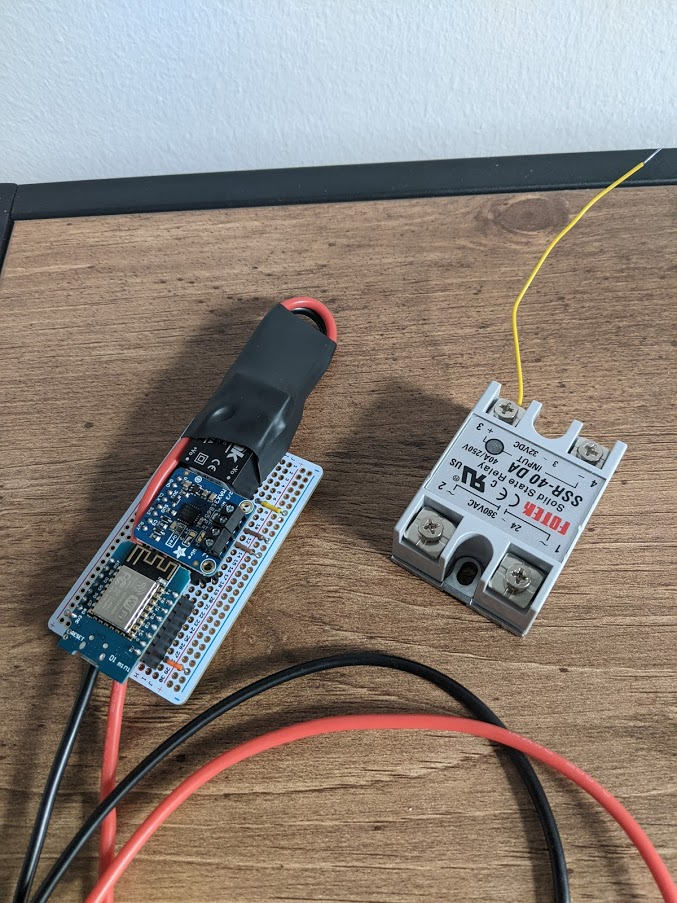

Step 1 was to remove the brew thermostat that I would be replacing with the RTD temperature sensor. You can see it in the center of the frame here (black/gold).

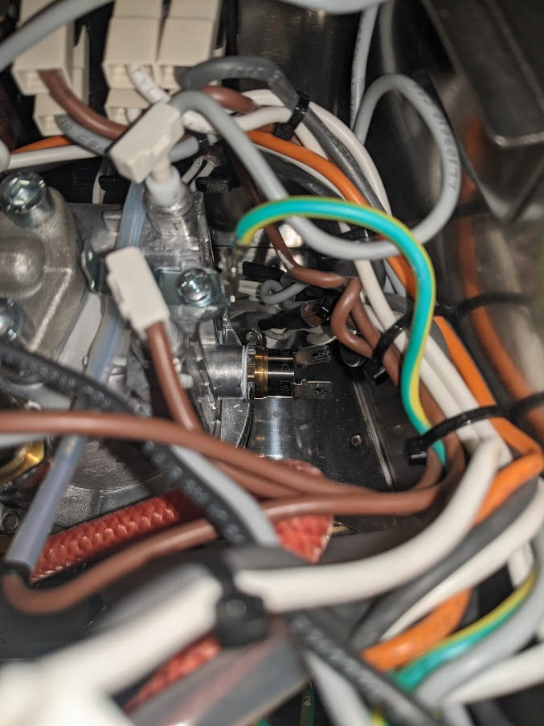

Thermostat removed with a wrench pretty easily.

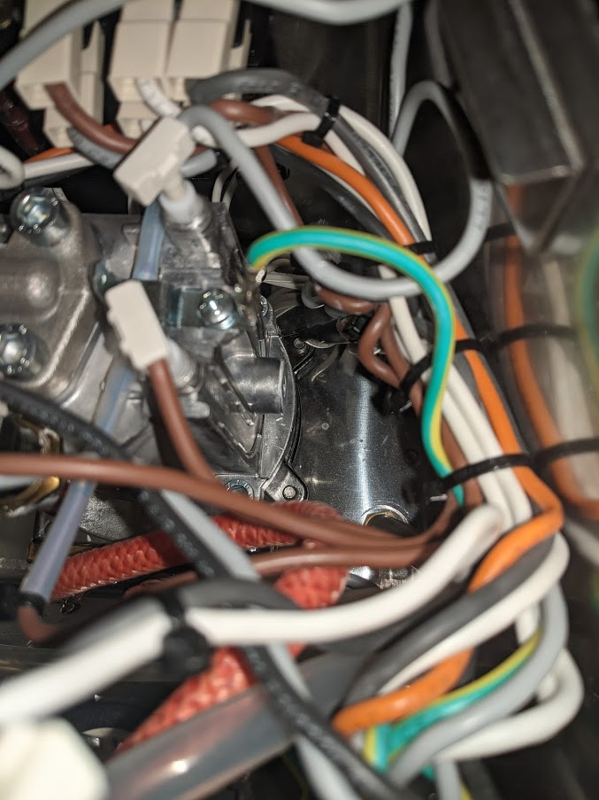

I thought I would be clever to be able to thread in the temperature controller...

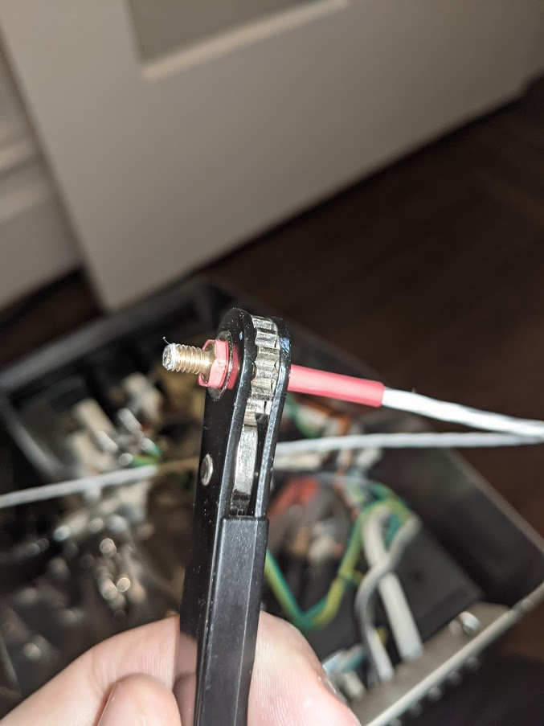

After literally an hour, maybe a bit more, I gave up. I could not get it to thread in no matter what I tried, and I did not want to damage the sensor since it took over a month to come from china... so I eventually tried something a little more unconventional... I drilled a hole into the side of the stainless steel so that I could thread it in from the correct axis. It threaded in instantly and made me question a lot of life choices at this point.

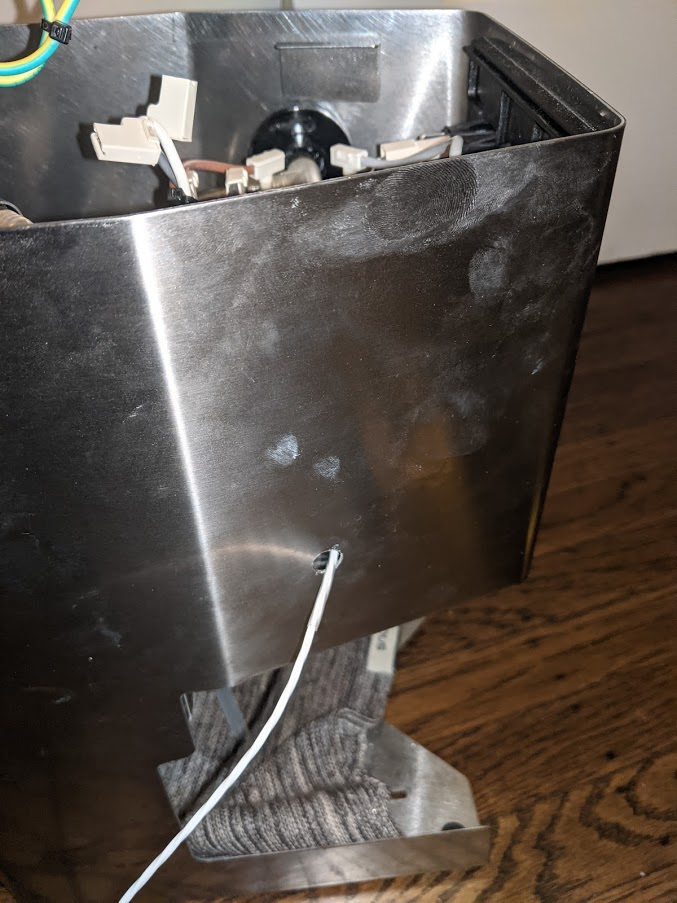

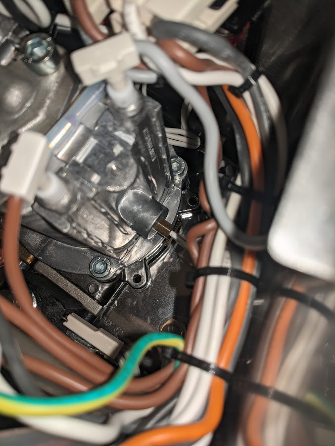

Then I just pulled the wire in from the inside and was left with this. I might try to find a plug or something at some point to close it up, but for now it is for "airflow".

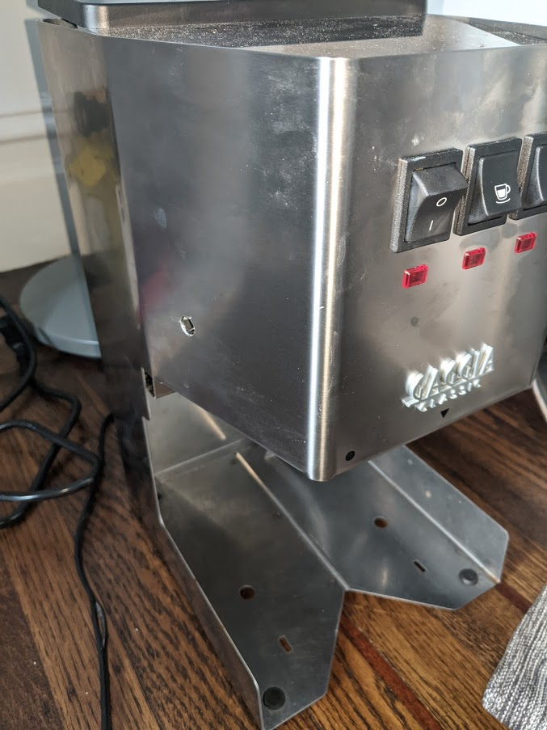

Next I used some thermal double sided adhesive to mount the SSR, and took the wires that were previously going through the thermostat, and put them on the output side of the SSR.

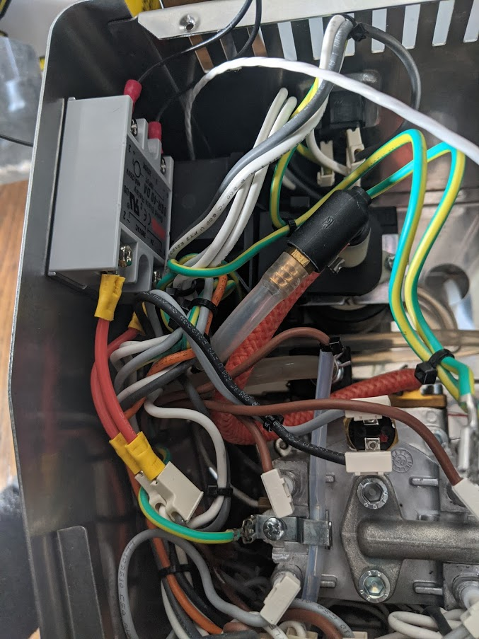

I piggybacked the neutral from the back of the unit. I took the hot wire from the power switch, so that the controller was only on when the machine is also on.

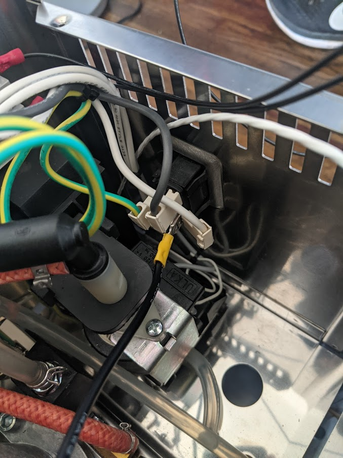

Everything all installed, wired, connected, and in place.

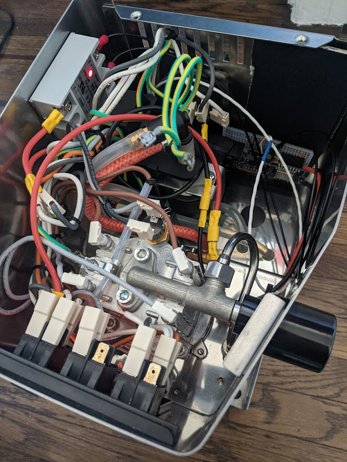

Here is the funnel that I had to work around, it allows you to fill the reservoir from the top of the machine.

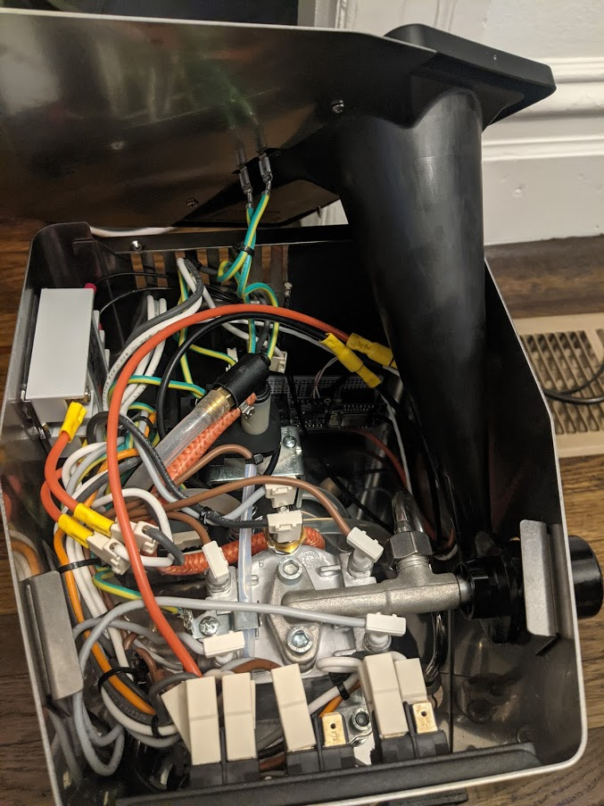

All finished and buttoned up! Now time to see if it works!

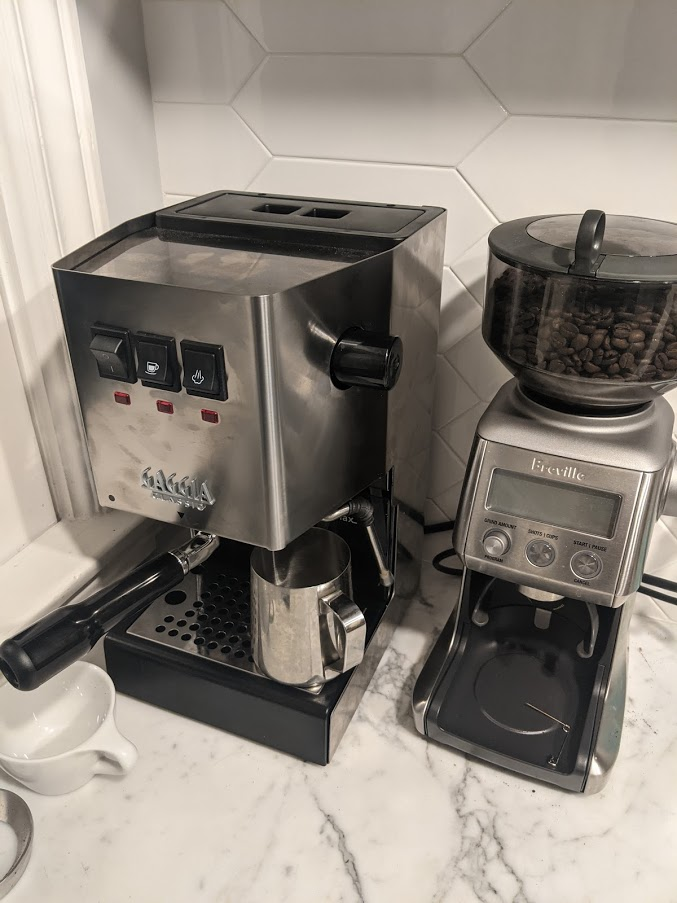

I wrote a basic python script to plot the realtime sensor data so that I could do some initial analysis.

The starting PID parameters I had programmed in actually seemed OK and the machine got to temp and stabilized. I then used CURL to enable autotuning.

```
curl -X POST xxx.xxx.xxx.xxx/autotunestart
```

Here is the realtime data from the autotune, it does a few disturbances and then does some math to spit out some ok parameters.

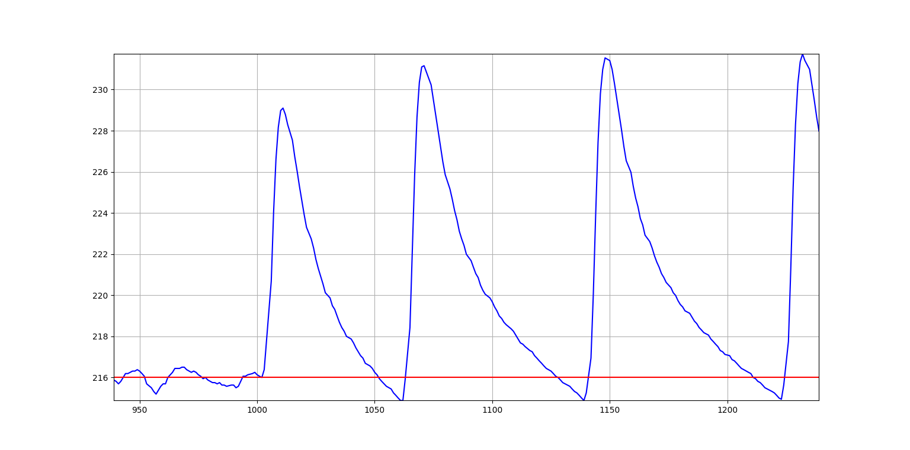

I then applied the parameters output from the autotune.

```
curl -d "kp=68.02&ki=1.63&kd=710.95" -X POST xxx.xxx.xxx.xxx/set
```

Saved these new values to EEPROM: 

```
curl -X POST xxx.xxx.xxx.xxx/save
```
And then was ready to pull a shot and see how things went!

In this graph, X is seconds and Y is temp in F. I let the machine come up to temp, then I brewed the shot (slight dip in temp as new water was introduced to the boiler), then I enabled the steam switch which bypasses this PID control and uses a 2nd thermostat (the large spike to generate steam), and then finally turned the steam switch off and the temp started dropping.

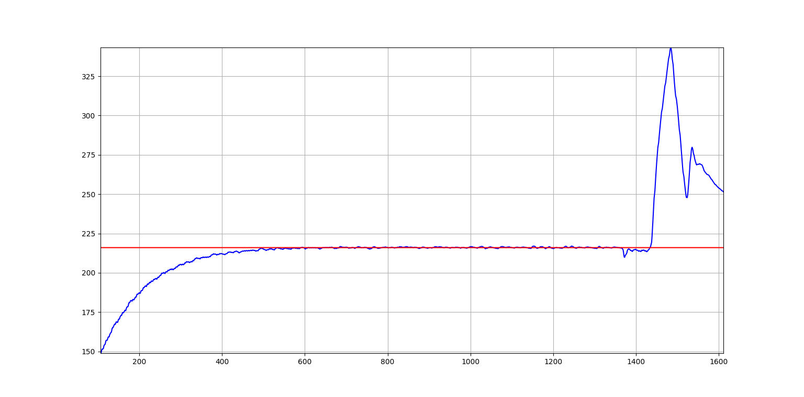

Here is a closeup of the drop during brewing the shot. the drop is not bad at all and recovers quite quickly!
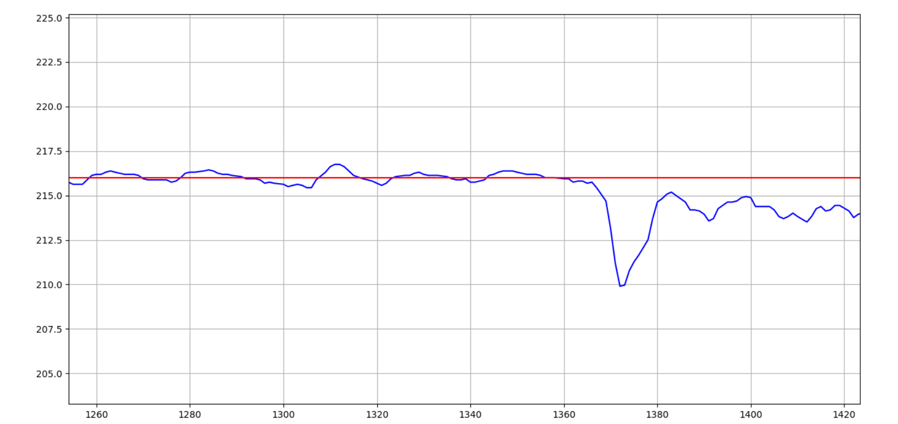

I was surprised at how much better and less bitter the shot actually tasted. Brewing at closer to 200 vs the previous ~220 is a huge difference.

I made a sensor to listen to the status data in home assistant and now can see this sort of thing anytime I want. For now I think I will just leave it all as is, not touch it, and treat it the same way as I did before, as a simple machine (albeit with much better tasting results)

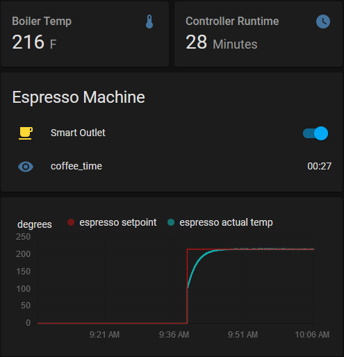

Overall I am very happy with how things turned out. The code was simple enough and worked the first try with only a minor bug in my autotuning code. Integration went well and the end product is clean, more functional, and non obtrusive. Time for me to go have another coffee...