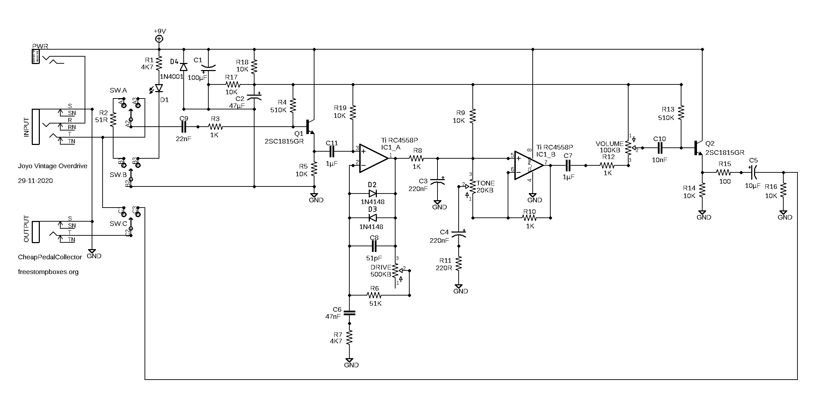
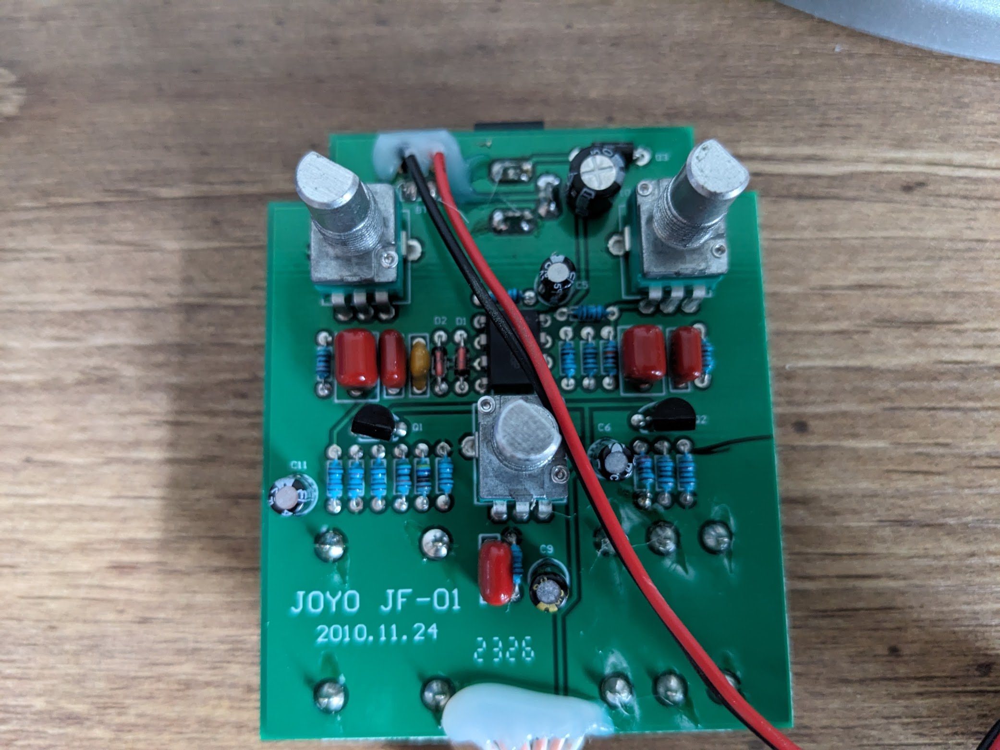
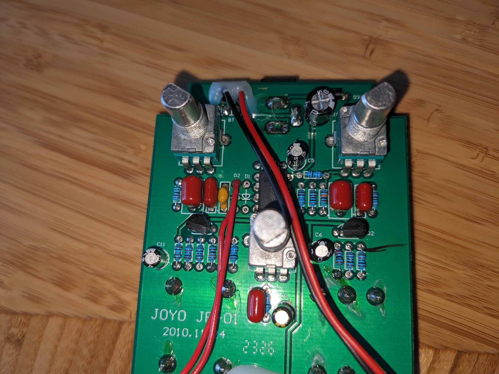
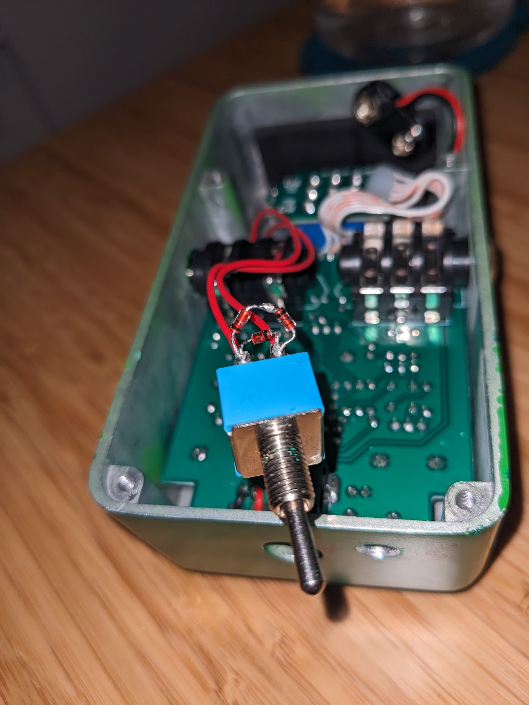
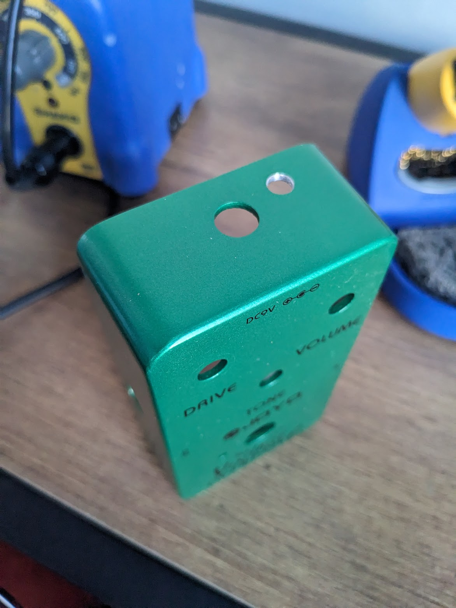
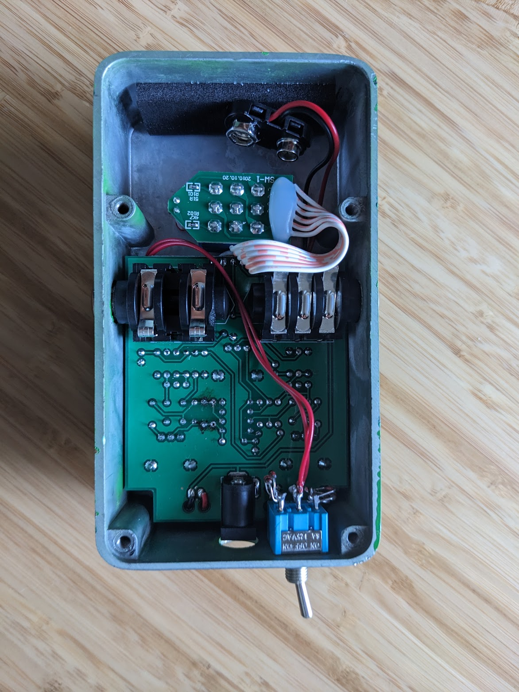
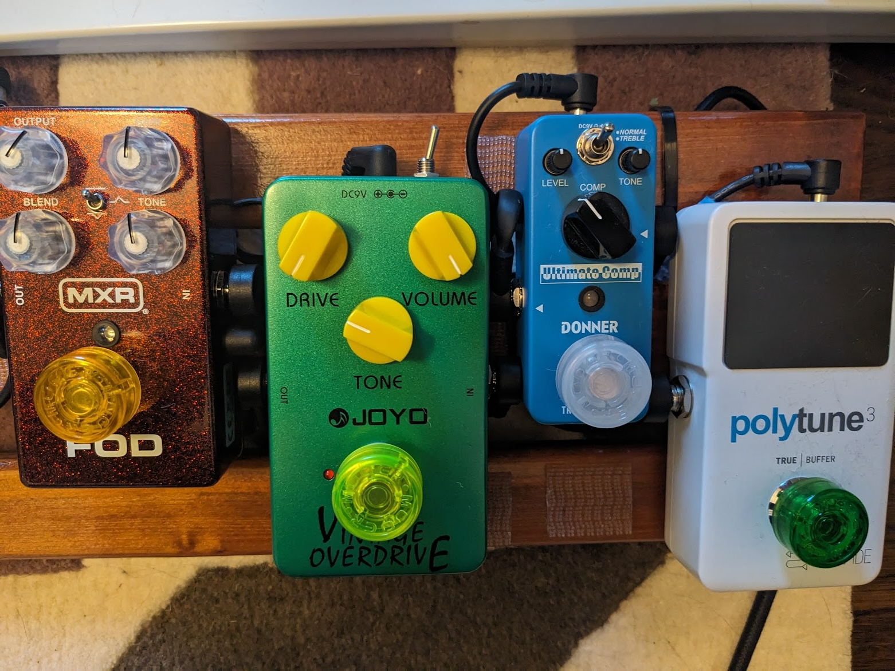
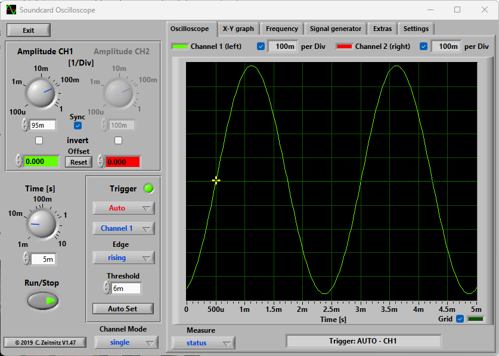
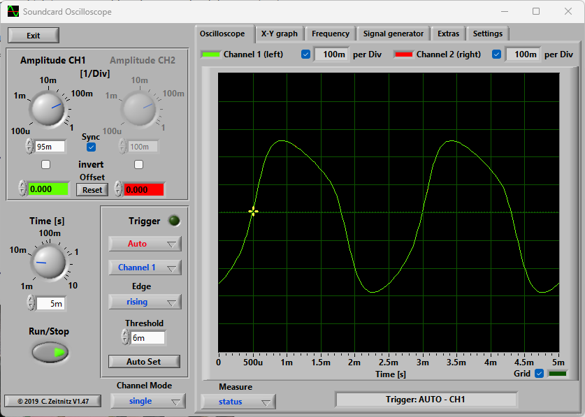
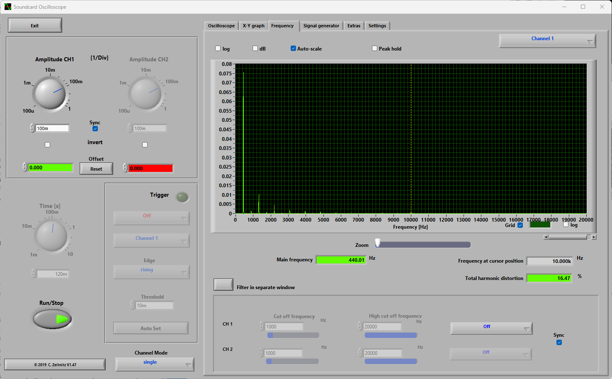

The [Tube Screamer](https://en.wikipedia.org/wiki/Ibanez_Tube_Screamer) guitar pedal is an overdrive that has been around since the late 1970s. For a $35 TS808 Tube Screamer clone pedal, the Joyo Vintage Overdrive sounds great.

I wanted to modify it since it uses through hole components and the TS808 has a ton of mod options since the circuit has been around for so long and is so straight forward. https://www.analogman.com/ts9.htm

Here is what the original schematic for the pedal looks like:

The plan is to add a DPDT on-off-on switch to adjust the clipping section of the circuit to offer symmetrical, asymmetrical, and no clipping options.

Here you can see D1 and D2 to the left of the op-amp in the symmetrical arrangement (these are D2 and D3 in the schematic).

My plan was to remove both D1 and D2, and use the pads to run a pair of wires to the common lugs of the DPDT on-off-on.

I then setup the symmetrical and asymmetrical silicon diode circuits to each side of the DPDT.

I had to drill a hole in the enclosure after finding a spot where the switch wouldn't interfere with the PCB and it would fit best on my pedal-board.

Everything seems to fit nicely back in the enclosure.

Then popped the pedal back onto the pedalboard.

I wanted to do some analysis on the waveform to see what the change actually looks like before hearing it.

I used https://www.zeitnitz.eu/scope_en with my sound card mic input as an oscilloscope. I plugged my phone into the input side and ran a 2kHz and 440Hz signal with a tone generator app to see how things looked.

Here is clipping disabled (middle switch position), you can see the wave form is a nice clean boost with no clipping.

Then this is the "stock" mode of symmetrical clipping.

And finally the newly added asymmetrical clipping.

I found it pretty hard to see the actual clipping difference, even at different levels of drive. I put a voltage divider inline to the sound card incase I was exceeding the signal level and clipping in the sound card, and was unable to see any significant change related to that.

When I looked at the harmonics however, it is obvious that there is a difference.

Here is the symmetrical frequency spectrum (only even harmonics):

Here is the asymmetrical frequency spectrum (even and odd harmonics):

Reference:
https://www.guitarpedalx.com/news/news/a-brief-hobbyist-primer-on-clipping-diodes
