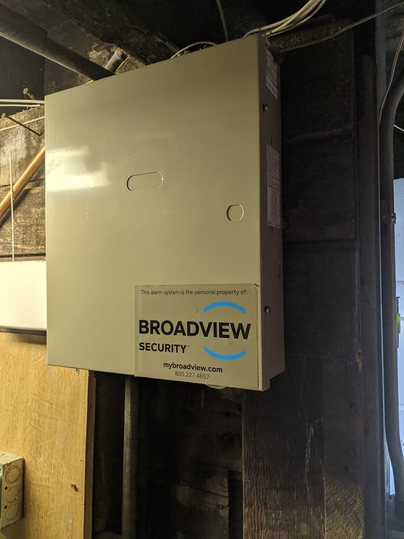
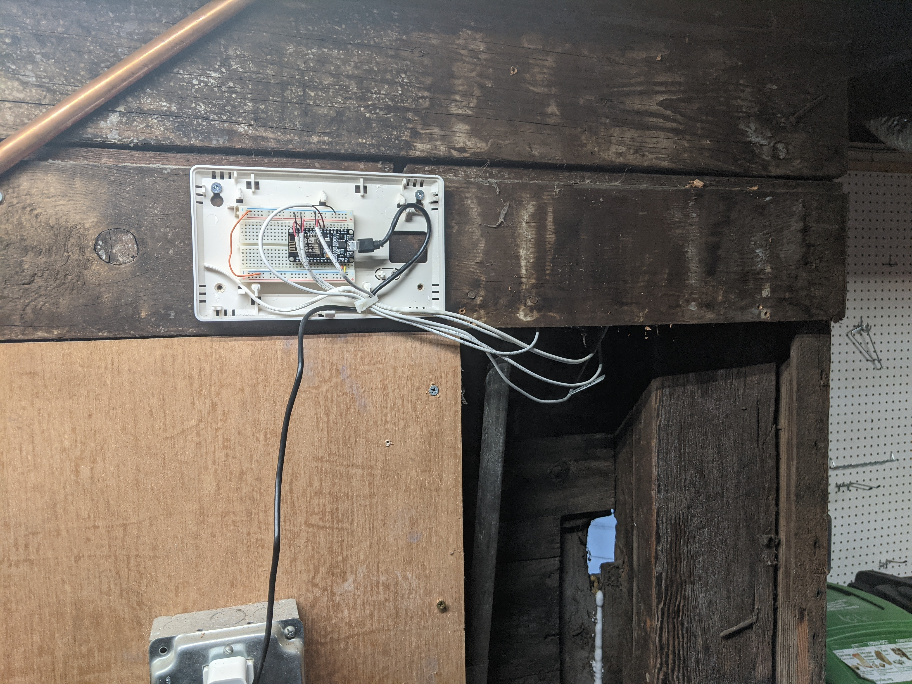
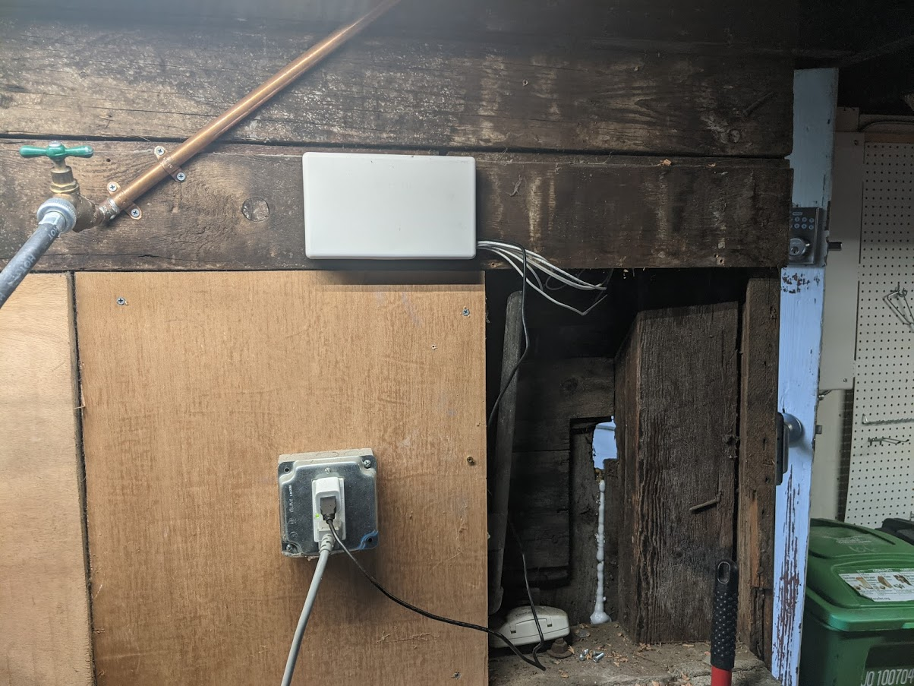
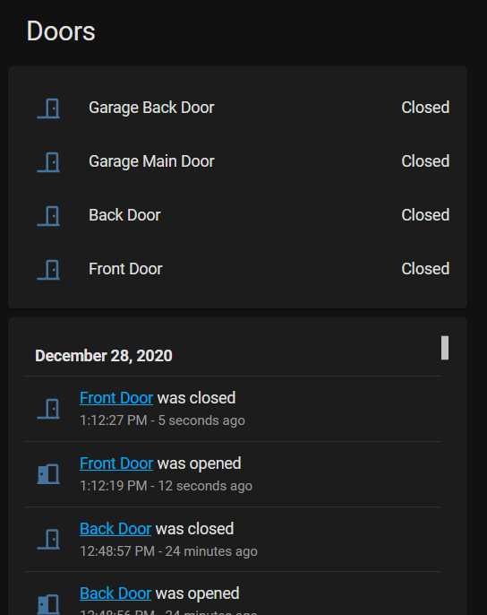

I have one of these old security systems from a previous decade. The company does not even exist anymore. I figured the sensors were still good though so I wanted to see if I could repurpose them.



I started running [Home Assistant](https://www.home-assistant.io/) on my server in a docker container. This allows me to script event based actions based on state changes from sensors. Doors opening/closing, detecting I am home by seeing my phone on wifi, turning lights on and off at certain times or based on certain things, etc. I already had my thermostat and a few off the shelf smart switches integrated and now it was time to add these new sensors from the security system.

I purchased an ESP8266 based [NodeMCU](https://www.amazon.com/KeeYees-Internet-Development-Wireless-Compatible/dp/B07PR9T5R5/) devkit. This is a pretty awesome little device for $5. It gets you a microcontroller with wifi for super cheap and no work.

I installed https://esphome.io/ onto the NodeMCU, this allows you to customize and publish events (sensors changing) to be consumed by another service, in my case, Home Assistant.

I then wired up my sensors from the ancient security system to the NodeMCU GPIO pins and configured them in esphome to use the internal pullup resistors. My entire esphome config looks like this:

```
esphome:
  name: security
  platform: ESP8266
  board: nodemcuv2

binary_sensor:
  - platform: gpio
    name: "Garage Main Door"
    pin:
      number: D1
      mode: INPUT_PULLUP
    device_class: door
  - platform: gpio
    name: "Front Door"
    pin:
      number: D2
      mode: INPUT_PULLUP
    device_class: door
  - platform: gpio
    name: "Back Door"
    pin:
      number: D5
      mode: INPUT_PULLUP
    device_class: door
  - platform: gpio
    name: "Garage Back Door"
    pin:
      number: D6
      mode: INPUT_PULLUP
    device_class: door

wifi:
  ssid: "******"
  password: "******"

  # Enable fallback hotspot (captive portal) in case wifi connection fails
  ap:
    ssid: "Security Fallback Hotspot"
    password: "******"

captive_portal:

# Enable logging
logger:

# Enable Home Assistant API
api:

ota:

```

I power it with a usb adapter, here is what the wiring and mounting looks like:



I reused one of the old enclosures from the security system and popped a ziptie in to get the wiring all nice.



Once I added the integration of the esphome device into home assistant I was able to start using these sensors to automate things.



Overall I am super impressed with what a $5 device can get you, and how robust and efficient it is. I can even do OTA updates of the firmware remotely via wifi.