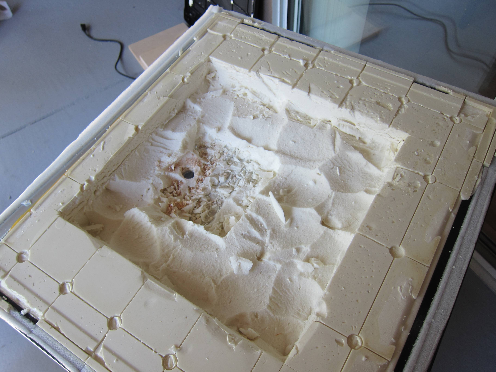
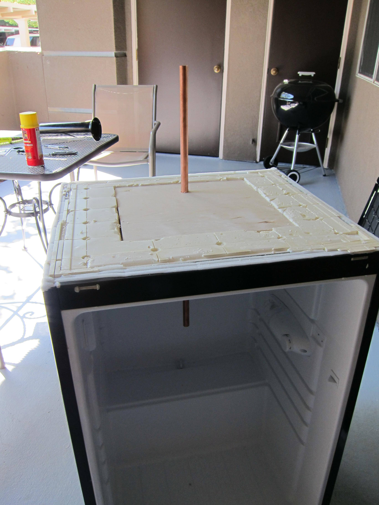
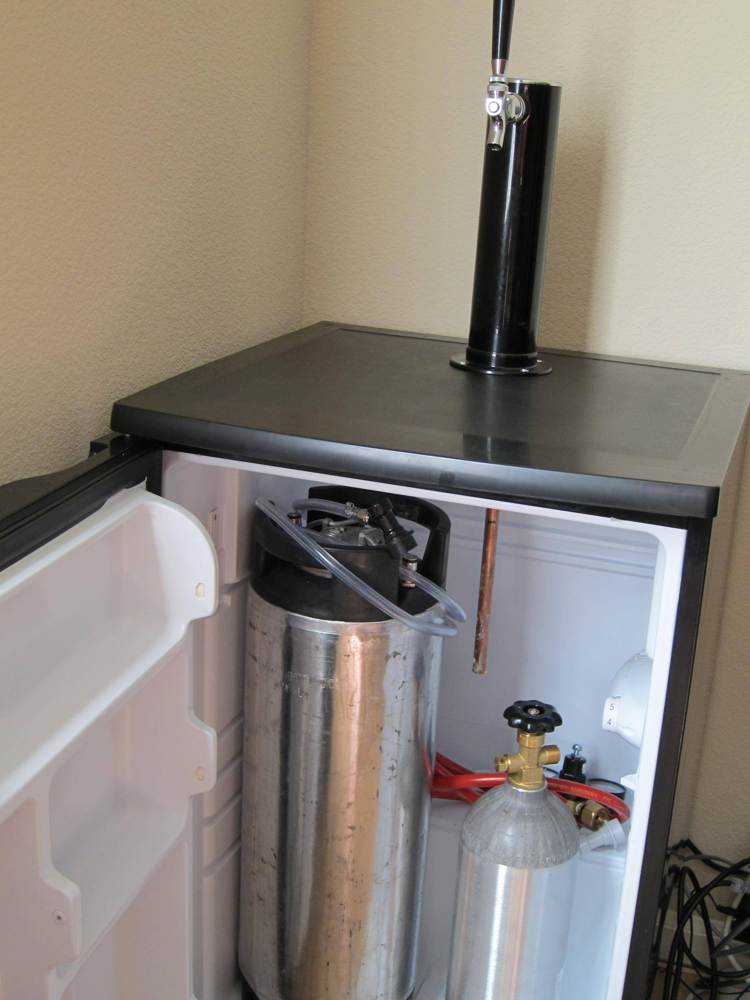
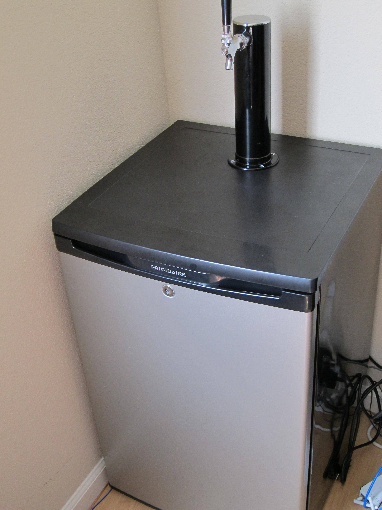

As I started home brewing more, I wanted to avoid the pain of bottling the entire batch of fermented beer. I decided to convert a fridge to a kegerator.

I bought the fridge new at Lowes for $200. Immediately upon bringing it home, I removed the “freezer” section (just a shelf on this particular fridge). Some mini fridges have cooling elements in this shelf. If there are cooling elements in the shelf, you have to SLOWLY bend the shelf out of the way and hope that you don’t puncture any of the cooling elements. If you do break an element, the fridge is garbage unfortunately. This was why I chose a fridge with an easily removable shelf.

Next up, I slowly peeled the top of the fridge off, it was just held on with glue. This exposed a foam layer. I carefully carved away at the foam layer with the intention of finding a safe place to drill (away from cooling lines), and so that I could place a piece of wood in the top to mount the tap tower to.

I carefully made it to the area where the cooling lines were, and drilled my hole. I placed a copper tube in the hole which would transfer some of the coolness from the fridge into the tower, to keep the hose (and beer) cool, and prevent foaming.

I then applied a bit of glue, and reassembled the top in the reverse order. Once the top was back in place and glued on, I was able to mount the tower, and screw it into the supporting wood.

This fridge fits 1 corny keg and the co2 tank inside perfectly, along with some 6 packs or extra bottles in the back.

Success!