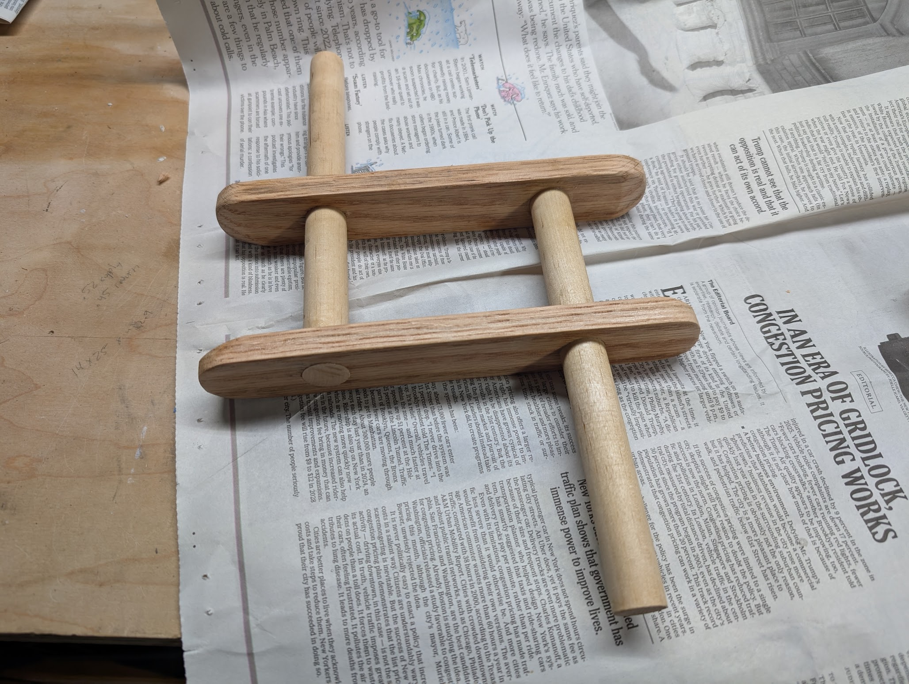
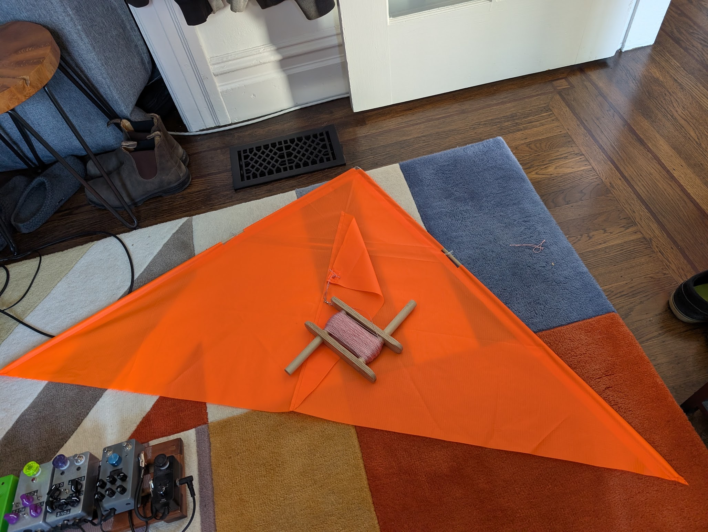
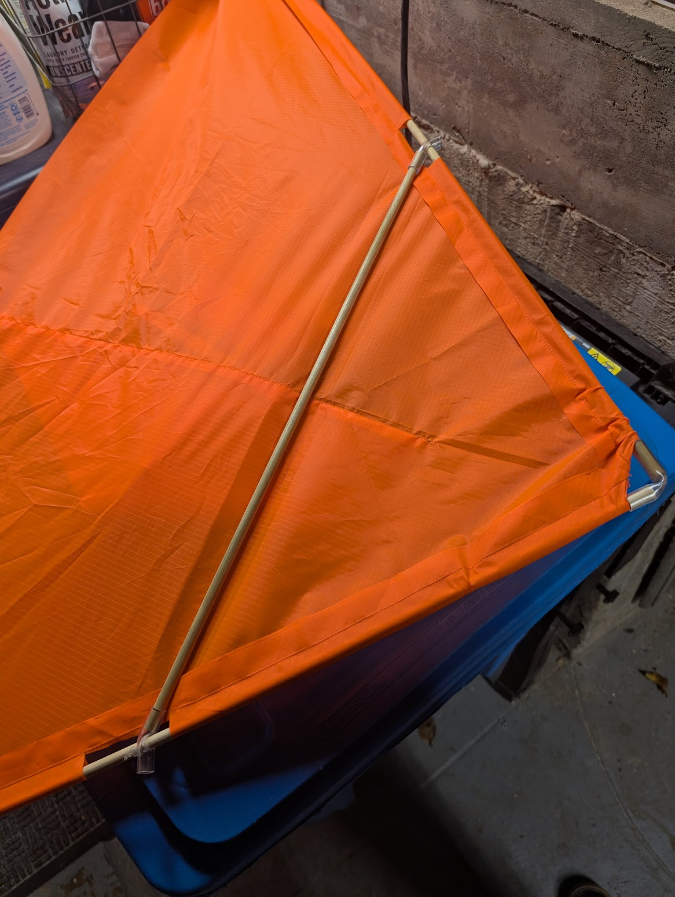
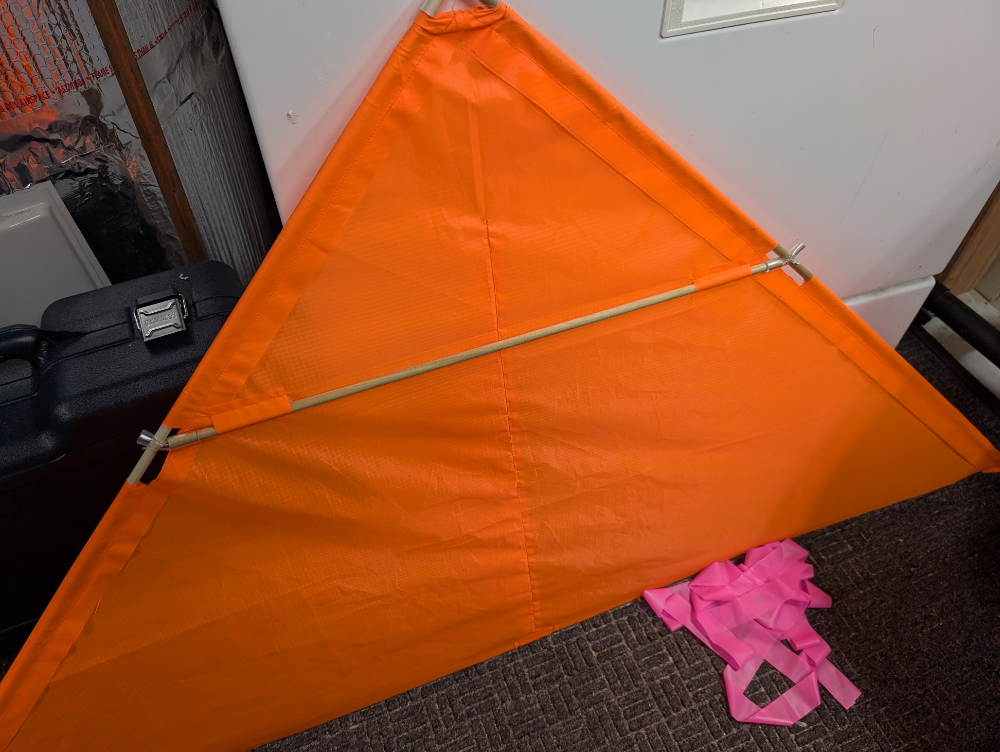
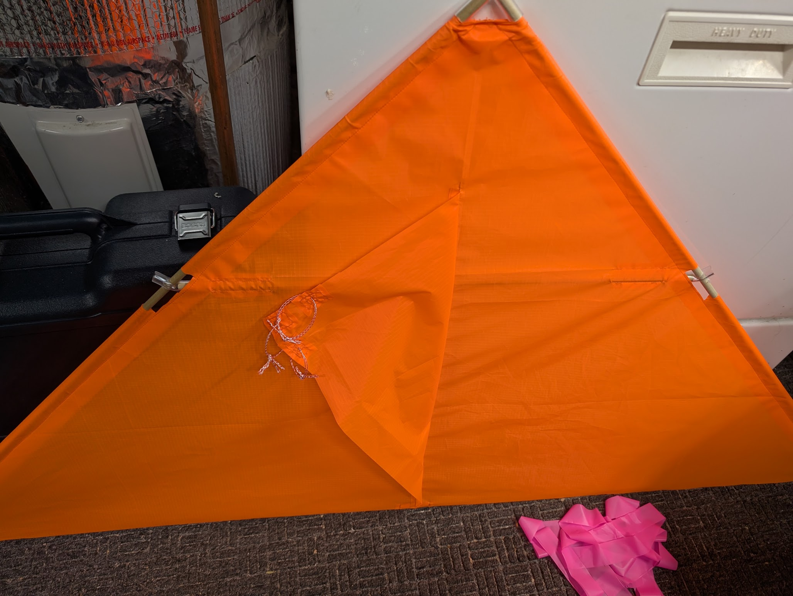
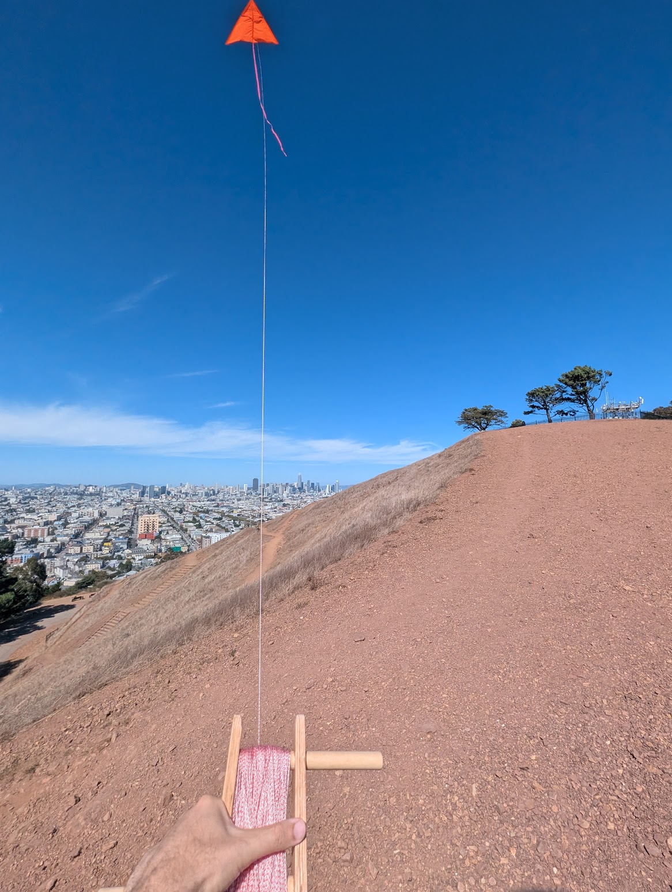
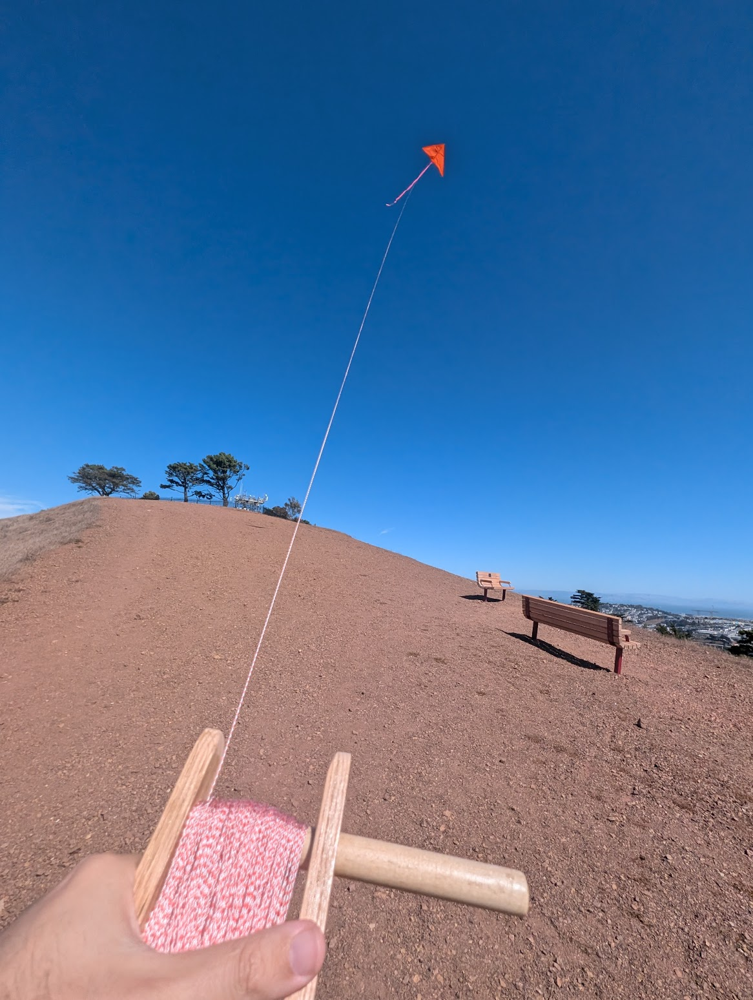
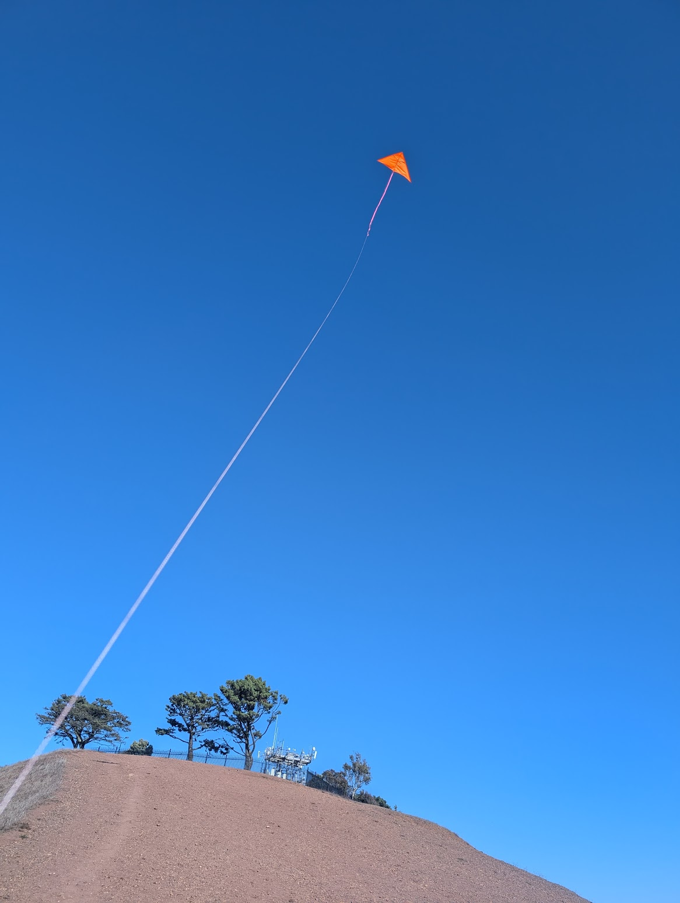

I got some ripstop nylon, dowels, poly tubing, and kite string and designed a delta kite. 

First a made a winder with some scraps on the workbench...

Then I used some plans to get the ratios and dimensions right. I found this site to be the clearest and most helpful.

https://www.deltakites.com/plan.html

I cut out the main triangle and the keel.

I outsourced most of the sewing to the in-house quilter.

I used poly tubing that fit the dowels to hold the nose and crossbar spars. Here is the first version put together.

The spot I fly the kite is SUPER gusty. The first flight didn't go great, it would start fine and then wobble out of control. I determined that the poly tubing was only a friction fit and while it would start in one position, the crossbar spar would quickly wobble out of position and cause an imbalance (also known as a crash to the ground).

We sewed some pockets in to do most of the supporting on the location of the crossbar. I also used some flagging tape as a tail.

We also added 2 additional mounting points for the kite string to the keel, one a bit more towards the front and one a bit more towards the rear (only a few inches of difference). This would allow me to try connecting the string to different spots to adjust the angle of attack into the wind.

Now to see if the modifications worked.

Success! It flys pretty well! The original/middle mounting point seems to work the best, but I was able to fly it mounted to all 3 mounting points.

It had been a LONG time since I flew a kite, and re-learning how to adjust the line tension to turn left or right, and how to easily launch and land the kite was a lot of fun.

I have always wondered about box kites, so maybe that will be next...
