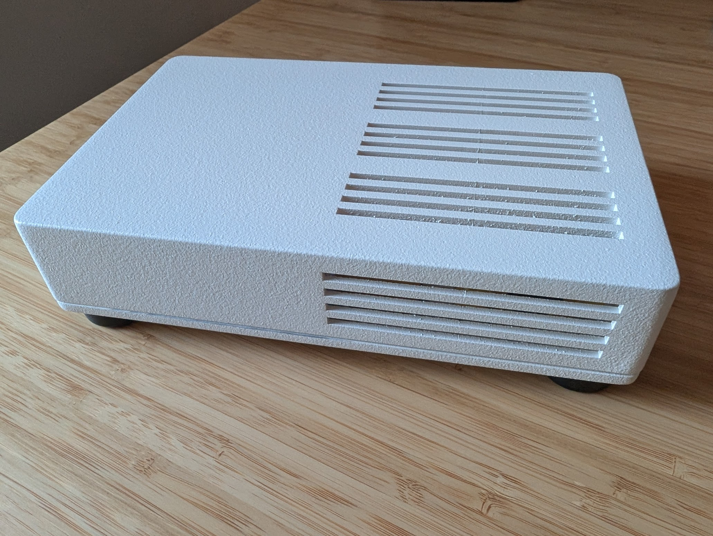
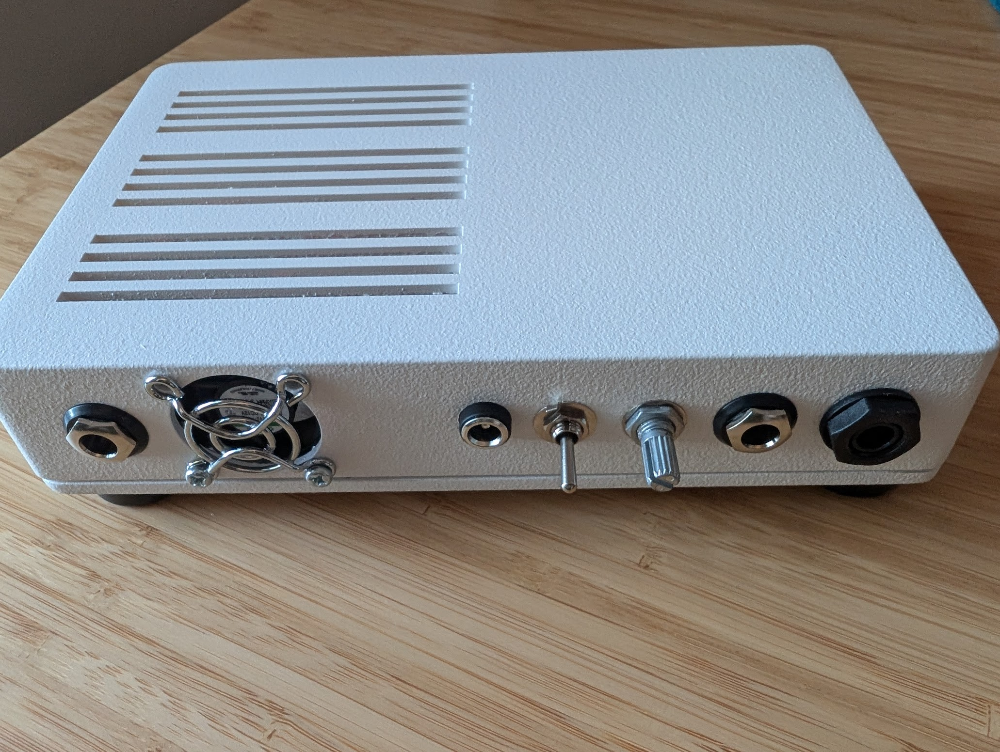
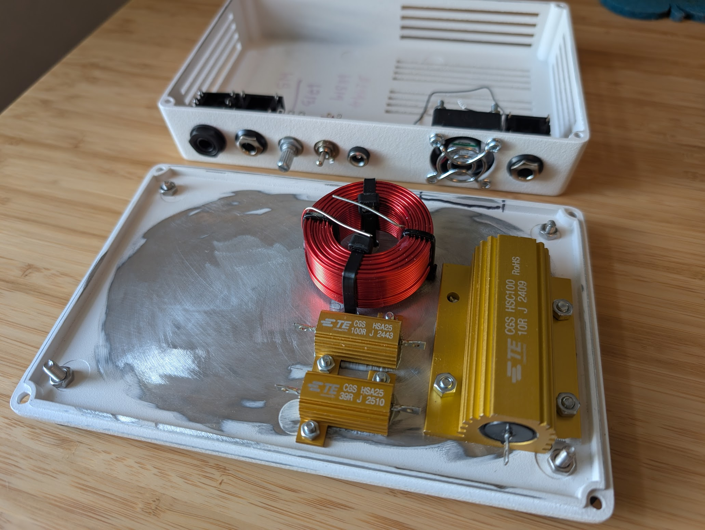
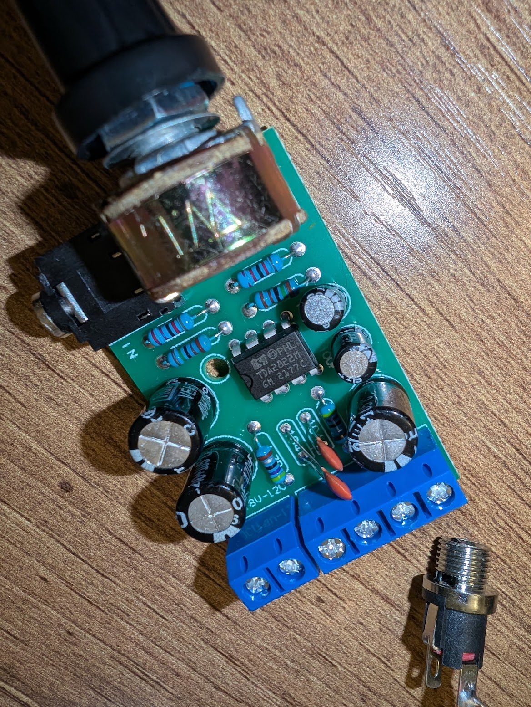
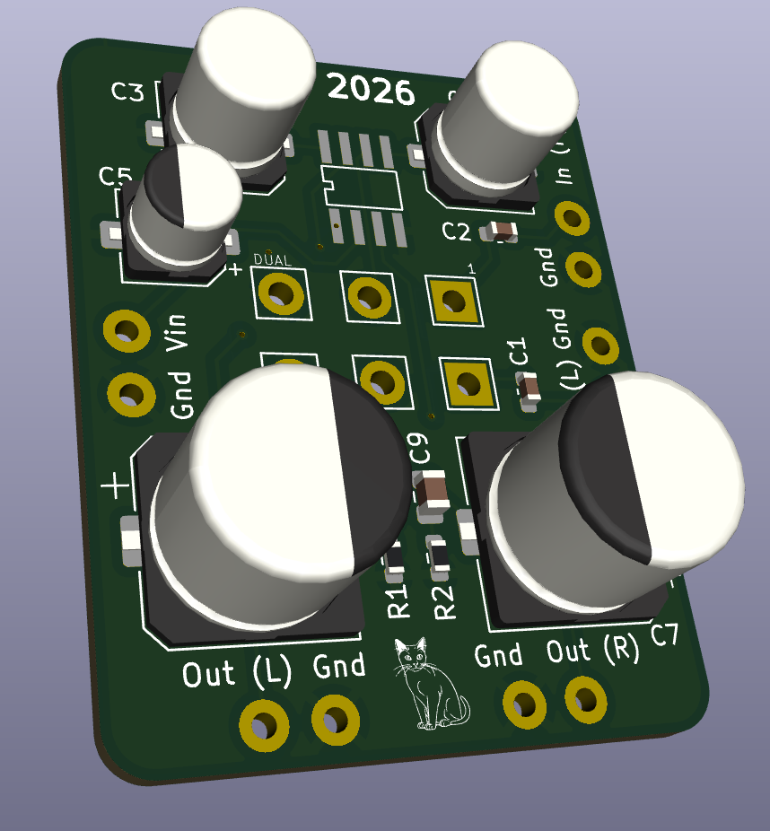
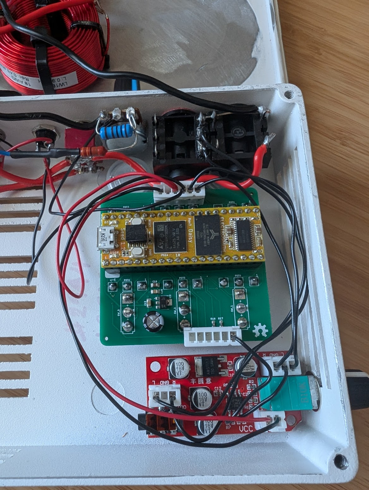
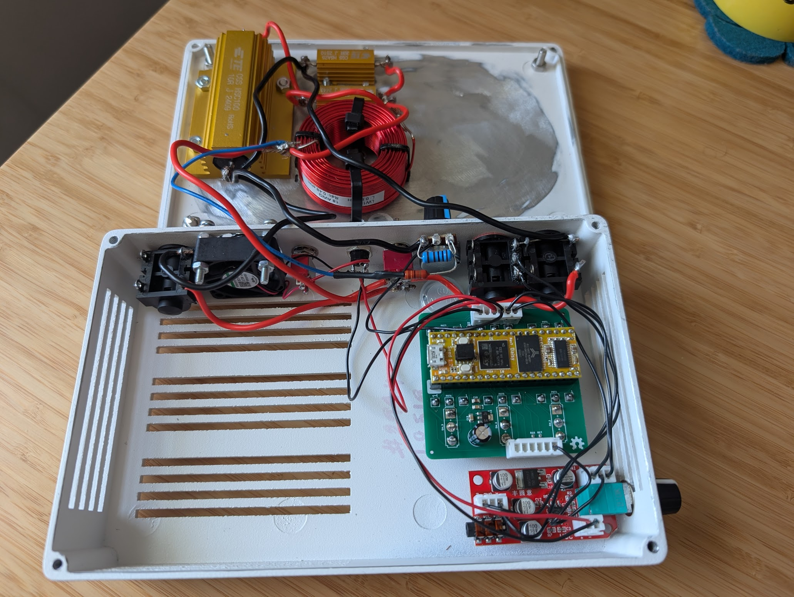
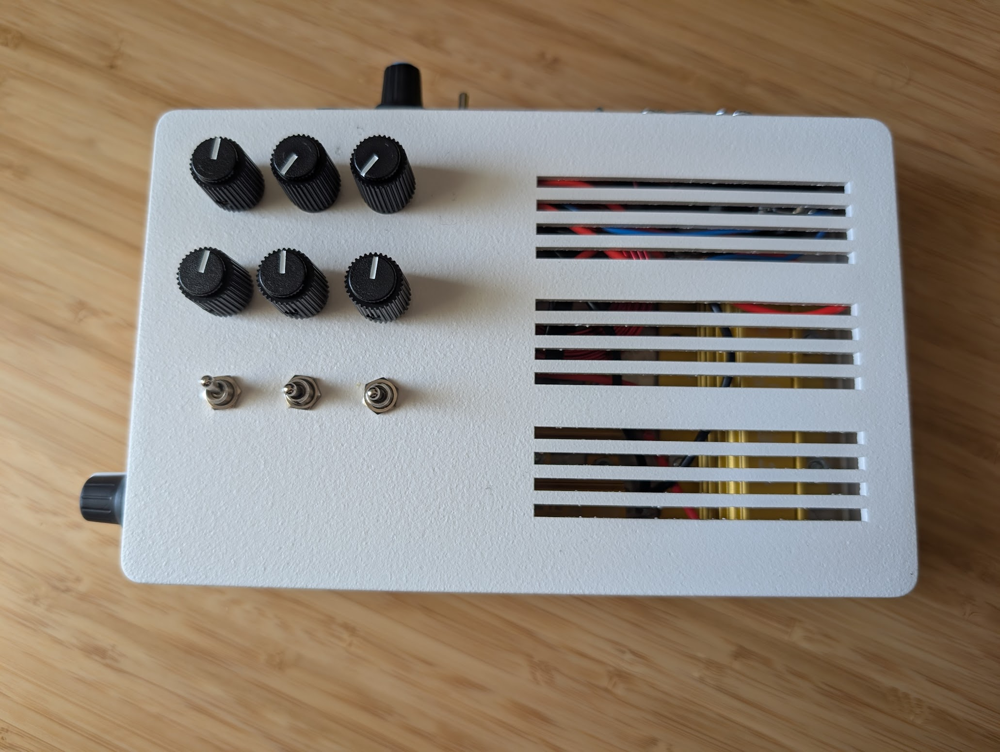
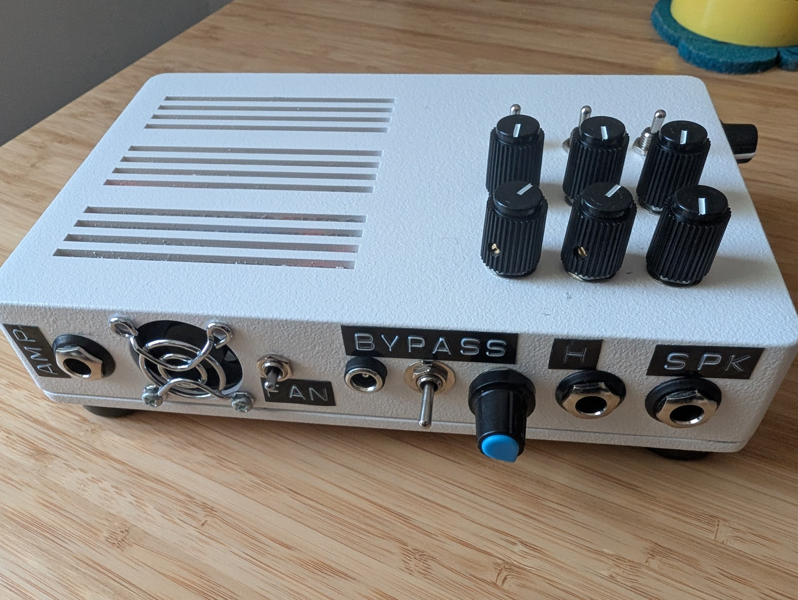
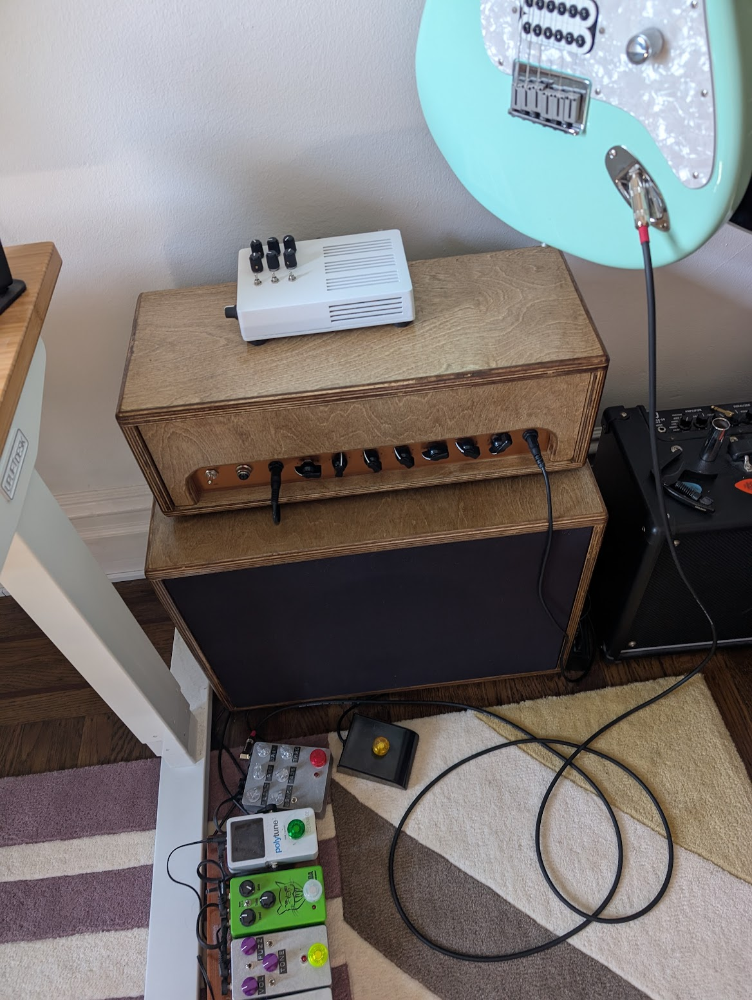

After completing my tube amp build, I wanted a way to play silently with headphones. A tube amp needs a load or a place for the electrons to flow. A solid state amp manages this in other ways, but for a tube amp, a speaker or substitute load is necessary. A reactive load is a dummy load that the amplifier sees that responds in similar ways to an actual speaker.

This is based on a project at https://github.com/optilude/MuleBox, the JohnH attenuator at https://marshallforum.com/threads/simple-attenuators-design-and-testing.98285/, the past experience/code I have played with for awhile now with the electrosmith daisyseed, and the hothouse PCBA (https://github.com/clevelandmusicco/open-source-pedals) from JLCPCB to save some time on a board spin!

Ordered the parts and components from https://www.parts-express.com/, https://www.mouser.com/, and https://www.taydaelectronics.com/. Tayda provides enclosure machining and powder coating services.

Reactive load components added to chassis.

I wanted to add a headphone amplifier, I was going to make a board based on the TDA2822, but after trying an off-the-shelf one, I was not happy with the noise floor. I suspected the IC might be counterfeit, so I ordered a replacement IC and swapped it and the noise persisted.

Here is the board I designed but ended up not using.

[This LM4881](https://www.amazon.com/dp/B08FCH2C1X) based one sounds great and fits so I didn't see the need to make my own PCB. The headphone amp is perfect for my usage, sounds great and even though the daisyseed can get pretty loud, it still isn't the same as some proper/maybe non-advisable volume into the ears.

Tight fit but its all in there!

Knobs are Level, Plate Reverb, and 3 band EQ. Knob 3 is unused.
Toggles are IR1/IROFF/IR2, pre-IR bass boost amount, and stereo spread enable

The stereo spread is basically always on, I like it a lot.

I added a switch to leave the fan off because I don't think I really need it/the buzzing of the fan since I have a 1W amp. This load will work with up to a 50W amp.

