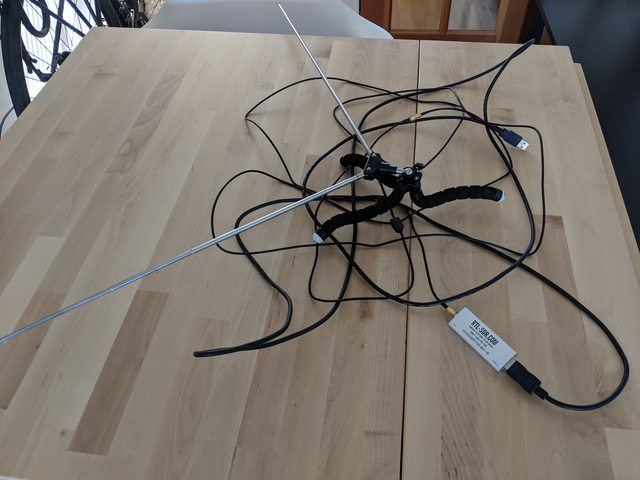
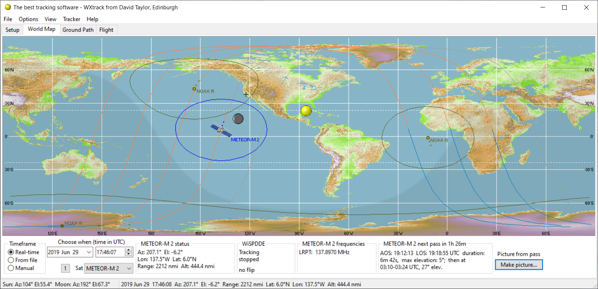
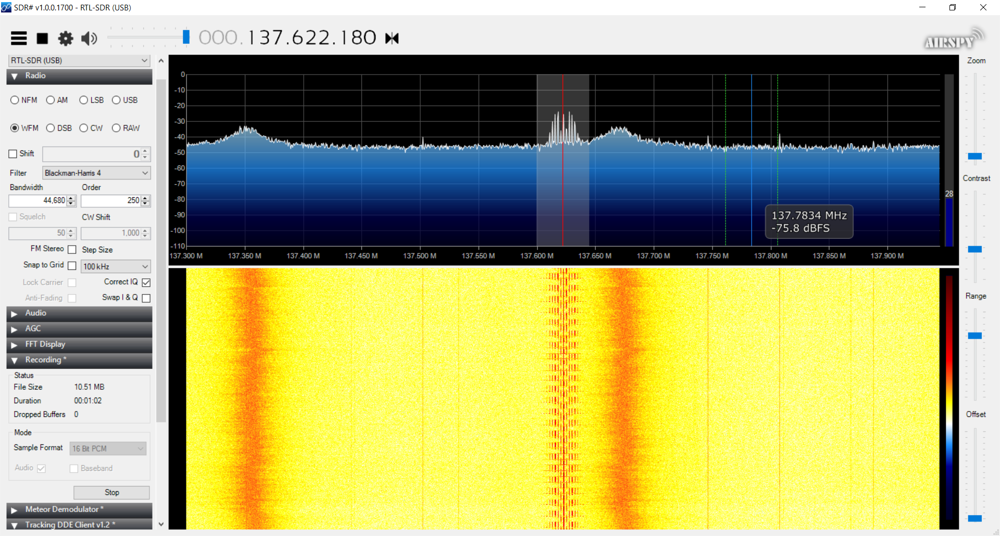
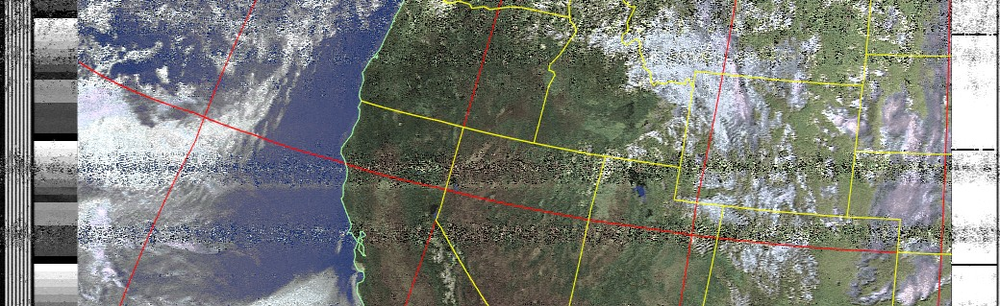
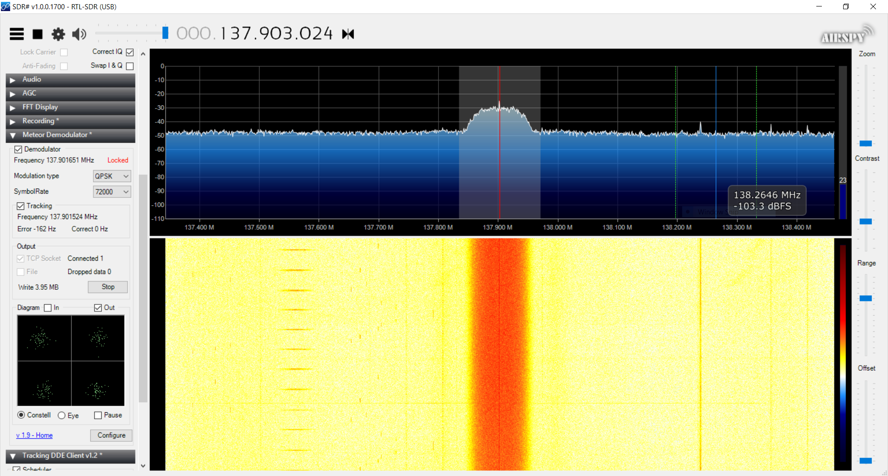
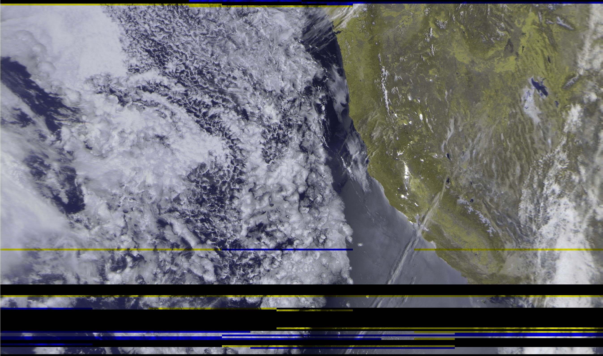
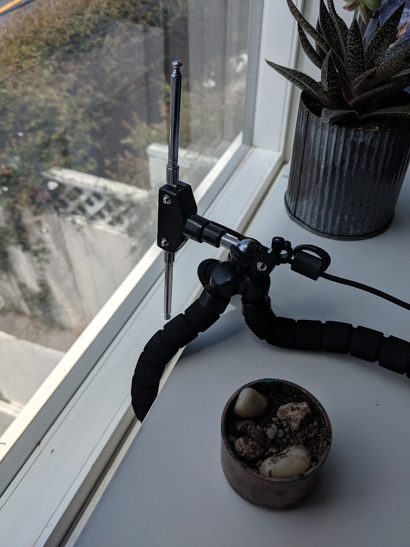
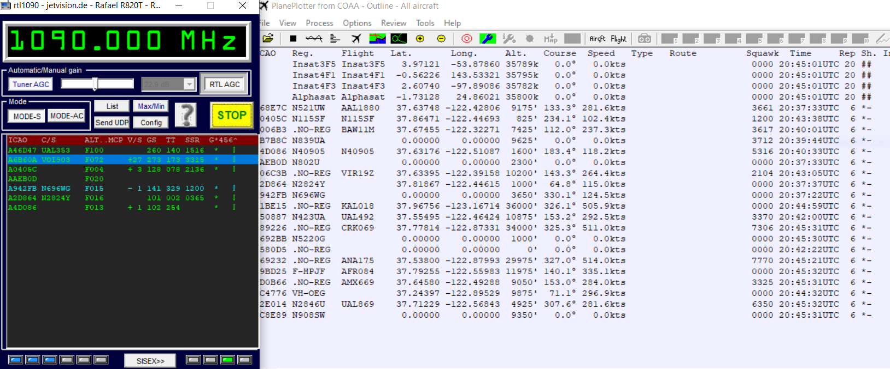
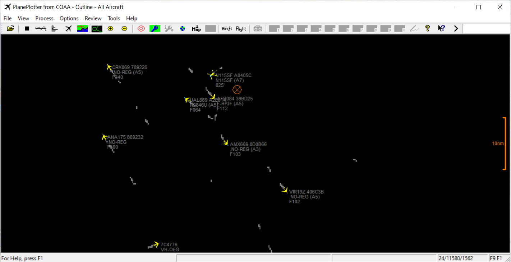

SDR (Software defined radio) is a technology that shrinks all of the amplifiers/mixers/components of a radio system into a tiny USB dongle and some computer software.

This is the kit I bought for $30:

  
[Amazon link](https://www.amazon.com/RTL-SDR-Blog-RTL2832U-Software-Defined/dp/B011HVUEME/)

Then I installed some free software SDR# which allows you to tune filters and gain and install plugins.

First up, I wanted to try and capture data from a NOAA satellite as it passed overhead. These satellites are constantly transmitting data/images at 137MHz and when in range, this data can easily be received and decoded.

I setup my antenna for this particular type of signal and frequency range using this diagram:

  

Then I opened up a program called WxTrack, put in my lat/long and was able to determine when the next pass would be.

I put my antenna outside, waited for the pass to start, and then started recording the audio as it was transmitted.

Once the signal disappeared, I stopped the recording, and ran the file through [noaa-apt](https://github.com/martinber/noaa-apt) which then helped generate this image!

Next up I wanted to try and receive data from a newer satellite known as METEOR-M2. This is a newer russian satellite that transmits a digital signal. There was another METEOR satellite that was supposed to be launched in 2017, however didn’t make it successfully to be operational. This digital signal then has to be demodulated and decoded into the image. This satellite has images that are ~10x higher resolution than the older NOAA satellites, however there is currently only 1 operational (vs ~4 for NOAA) so there are limited opportunities to receive data. Another is planned to be launched in July 2019, so we will see what sort of data that transmits! [^bignote] Here is the wave form during the METEOR-M2 pass:

And then here is what was generated from the decoding of the data!

Next I wanted to track airplanes near me using their ADS-B protocol. This is a signal coming in at 1090MHz so this is the antenna configuration necessary:

I ran some software called RTL1090 which uses the hardware to decode the data being received and send it via TCP to PlanePlotter which shows the planes in a visual way

I verified with FlightAware that this data/flights/call signs matched!

[^bignote]: :( from [wikipedia](https://en.wikipedia.org/wiki/Meteor_(satellite)#Meteor-M):
    "On 5 July 2019, the replacement satellite for the failed Meteor-M No.2-1 satellite, the Meteor-M No.2-2 (also known as Meteor M2-2) was launched from Vostochny cosmodrome.

    On 18 December 2019, image downlink from Meteor-M No.2-2 ceased. Tracking revealed the craft had suffered degradation in orbit with a 2 km (1.2 mi) decrease in perigee. NORAD was not able to identify any space object involved in a collision. Roscosmos later confirmed that the satellite had suffered a decompression of its thermal control system following what is presumed to be a micrometeoroid impact. Following the incident, the spacecraft was automatically switched into a low-power mode and ground operators worked to restore the satellite's orbit and orientation. By 25 December 2019, the satellite had resumed controlled flight, but the future of its mission remains uncertain.

    Other Meteor-M satellites have been planned but their realization is uncertain."
