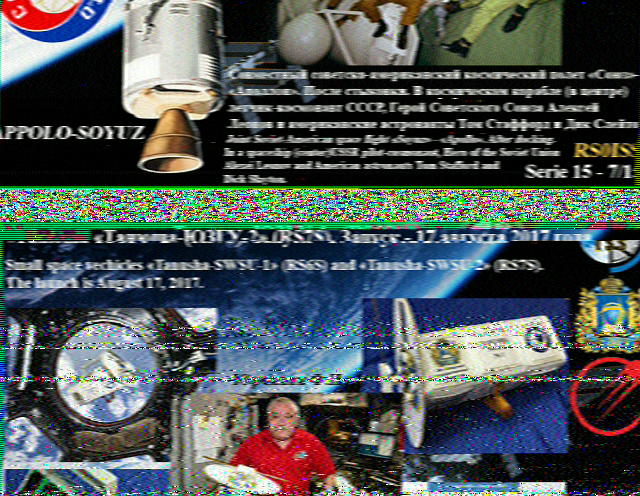
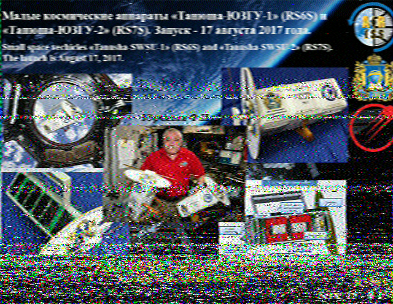
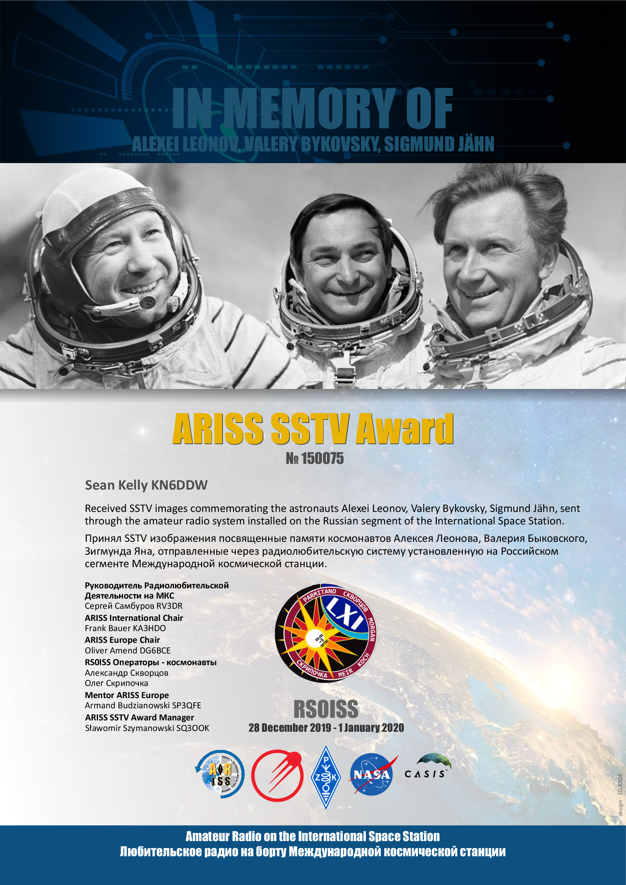

Ever since I started messing around with SDR and HAM radio, I have been eager to receive something from the ISS. I have tried a few times as it passed overhead with my handheld radio, but never had any luck.

A few times a year, the ISS transmits SSTV (slow-scan tv) signals with their onboard radio transmitter, to commemorate certain events. These can be monitored at ARISS (Amateur Radio on the International Space Station):

http://ariss-sstv.blogspot.com/

These transmissions only last a few days, and you need to have a decent pass overhead of the ISS during this window to try and receive a signal.

Well the blog above had an event coming up that I wanted to try and receive!

"SSTV from December 28, 2019 until January 1, 2020
ARISS will be supporting SSTV transmissions worldwide in memory of cosmonaut Alexei Leonov. Event runs from Dec 28 (11:00 UTC is the setup time) until Jan 1, 2020 (18:20 UTC when the system is scheduled for shutdown). Transmissions should be on the standard frequency of 145.800 MHz and in the PD 120 format."

I checked https://www.heavens-above.com/PassSummary.aspx and found a pass that wasn't in the middle of the night (for my own sanity...)

I decided to use my SDR to record the audio transmission, so that I could post process the results after the fact and I could tweak the gain and do a bit of filtering as well if needed. I setup my dipole antenna for 145.8 MHz, tuned SDR# to 145.8 as well, and waited for the pass.

SSTV is pretty interesting, it takes about 100 seconds to receive 240 lines of a colored image using frequency modulation with a pretty small bandwidth of up to 3kHz!

https://en.wikipedia.org/wiki/Slow-scan_television

Since a pass lasts only a few minutes, I got the tail end of one image followed by a gap of transmission during the prime overhead portion of the pass, and a 2nd image during the tail end of the pass.

I used [MMSSTV](https://hamsoft.ca/pages/mmsstv.php) to decode the image from my recorded .wav of the pass. I set my computer up to loopback audio, set the input source in MMSSTV to be the output from my laptop with a [virtual audio cable](https://www.vb-audio.com/Cable/), and used mode auto-detect (PD120).

Here is what the end/start of the images look like, there is a header that contains a start tone, some calibration data, and some other signalling codes that are used to identify the mode of encoding. This header is where the green line is.

Here is the full image I got towards the end of the pass overhead!

I submitted my image as proof to ARISS and received this certificate:

Edit:
2 Days later, I was still within the transmission window and had another decent pass coming in. Here was what I got:

Pretty frustrating, here is a diagram of the pass. The images take ~2 minutes to transmit, followed by 2 minutes of radio silence, and then they start transmission of a new image. I drew the red line on the 2 minutes of silence part of this "perfect" pass. The image I did get was on the tail end of the pass. I heard everything loud and clear on the entry and the exit, but the 2 minutes of silence during the prime portion was no fun!

I should have used my radio to ask them to slow down.