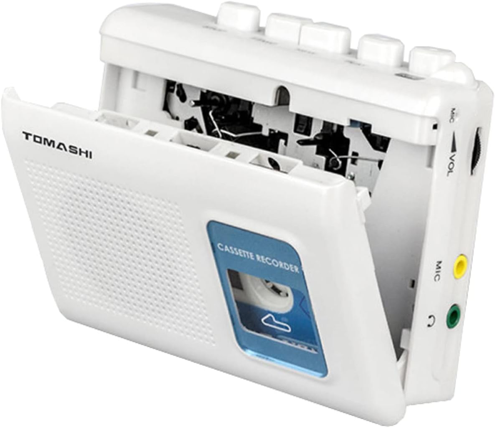
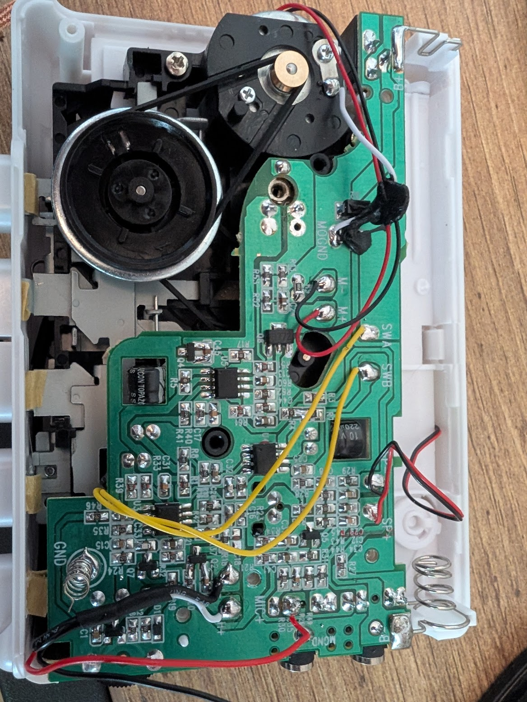
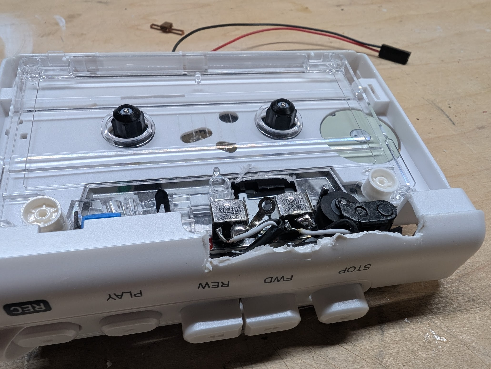
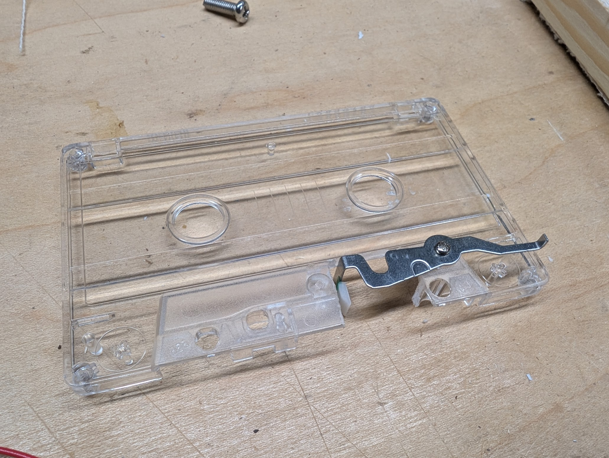
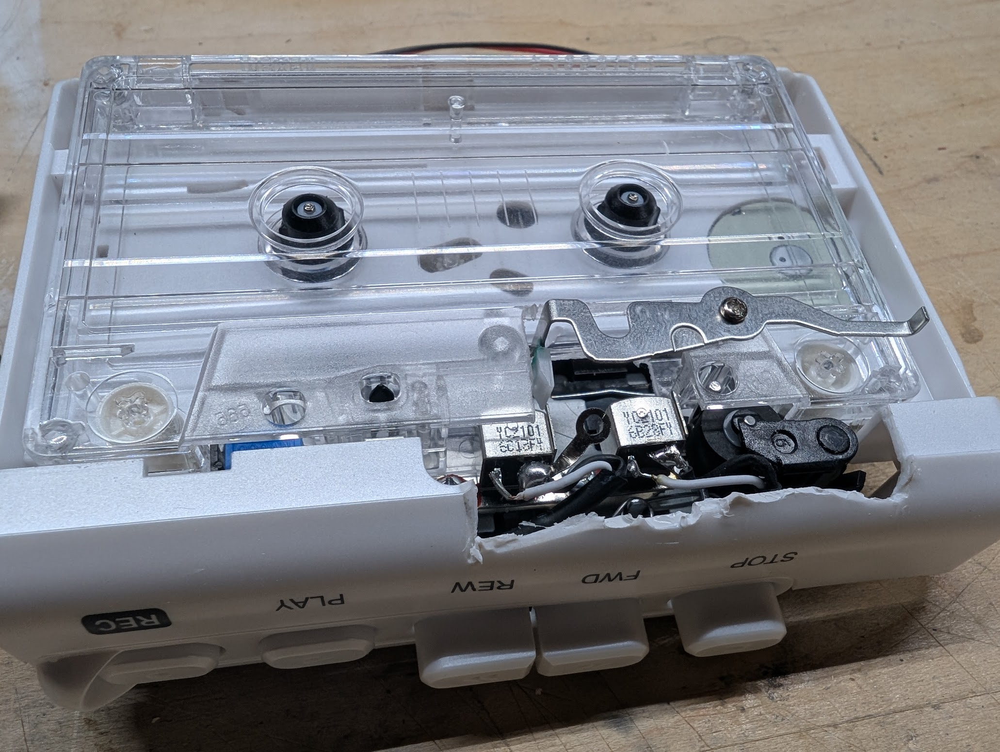
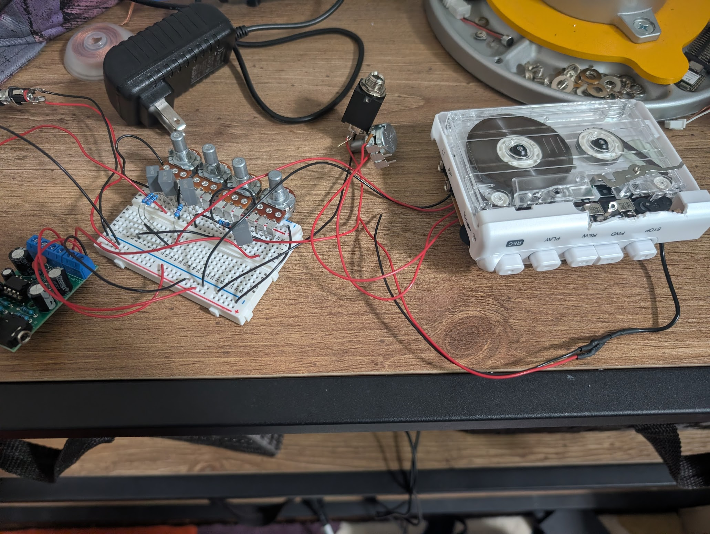
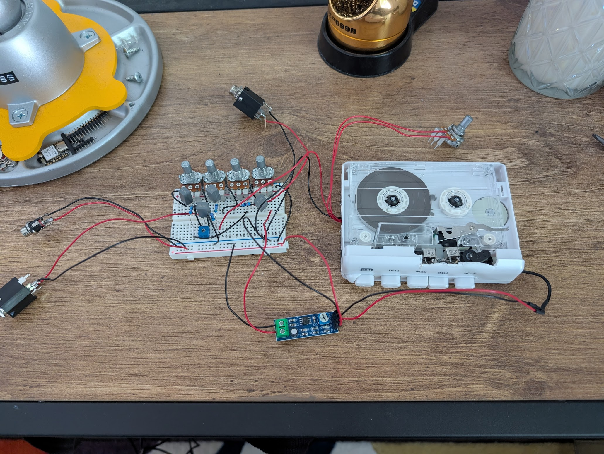

I wanted to take a step away from C++ and DSP for a little bit and may have gone too far into the past this time...

Credit to https://www.youtube.com/watch?v=mkWXUk2At18 this guy for his idea.

I bought 2x of these $20 tape players. The important part is that they also record. https://www.amazon.com/dp/B09XQCLTYF

I opened them up to see what I was working with.

I removed the trim potentiometer from the PCB for the pitch adjustment and wired in a potentiometer that I could use easily, this was to control the speed of the tape (time between the playback of the dry signal and the tape echo effect).

I then removed the tape head from the 2nd unit, and mounted it a little bit to the right of the original tape head. I will use the first tape head to RECORD the dry guitar signal to the tape and then the second tape head will PLAY the recorded signal back. I will then mix this wet signal/echo back in with the original dry guitar signal and create my echo effect.

I modified a cassette to accommodate this new playback head and also added a way of tensioning it.

Put it all back together and created my initial mixer circuit to mix the wet and dry signal. I also feed the output back into the record head for an optional feedback effect.

Originally I tried to use a TDA2822 I already had to play from the playback head, but ran into some issues. I switched to a LM386 at 200x gain and this worked pretty well.

Here is the completed hardware.

After testing it, the fidelity of these tape heads is pretty low, so I don't plan on putting any of this in an enclosure. A nice tape echo effect for guitar will typically also have some options for warble or other weird fast/slow effects that could be done be replacing the potentiometer with a micro-controller that could alter the motor speed in different ways.

The first few seconds of the video are the dry only input signal, I then bring in some of the wet/delay, and finally bring in a little bit of the feedback.
