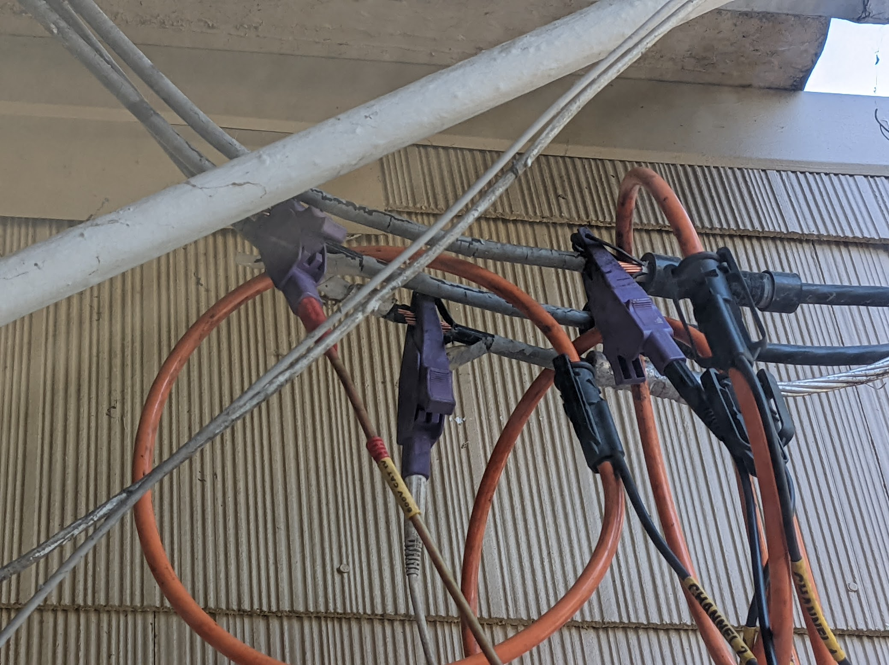

After replacing quite a few incandescent bulbs with LED bulbs, I noticed a pretty severe flickering that would come and go in surges. This was not related to bulbs because I soon was able to notice it with incandescent bulbs/fixtures as well.

I decided to log voltages on a few circuits in my house and figured I would start with outlets prior to specific lighting fixtures to establish a baseline. I have some smart outlets that report voltage, but the sample rate is not really controllable and some of these voltage events seemed very short.

I bought a DMM for $35 that had USB support and found some sample code that could interpret the protocol.

https://www.amazon.com/gp/product/B07C238GTP

https://github.com/adnidor/vc820py

I then added an ability to report the readings to CSV or MQTT and hooked it up to a raspberry pi for deployment/long term use.

Source code for the dmm logger is here https://github.com/xconverge/dmm-plot

I used a 9V DC power adapter to not waste batteries, and just put the probes into a socket in the garage. I was going to make a plug...but I have made it weeks/months without making a special plug adapter so shoving probes in the socket it is!

The first plot looked pretty good, I had a sample rate of about 1 second which would be a good place to start.

Here are a few plots of some pretty large voltage sag events over a few weeks/months.

I sent these plots to a random email I found for the "voltage reliability team" at PGE and within a few days I got a phone call! This was a pretty big surprise but the person I talked to was quite eager to figure this out. He said they are regulated to +/- 5% which for 120V is 114V. A few days later, a bucket truck showed up and installed a voltage logger onto the supply to my house. 

My neighbors were probably rolling their eyes by this point...

Voltage sensing on the 2 phases, and current clamps (big ones!) to log load

The voltage logger was left on my house for 1 week. Here is "my" plot/log of what happened during that time. Not great but not terrible.

Next up is waiting for PGE to analyze the data and decide if there are any next steps...

...I am not optimistic?

2 weeks later... I get a phone call and he confirms that there are some pretty bad looking problems and that they are outside the range of what they are regulated to provide. There is not going to be a quick fix so he asks for some patience as he figures out what to do and if there are any short term fixes like switching a few customers on the block to the other leg, etc. He said that there is a chance that they need to rewire the block and due to the latest standards that would mean new poles and everything... my neighbors are going to hate me...

...time to wait more but that is good news!